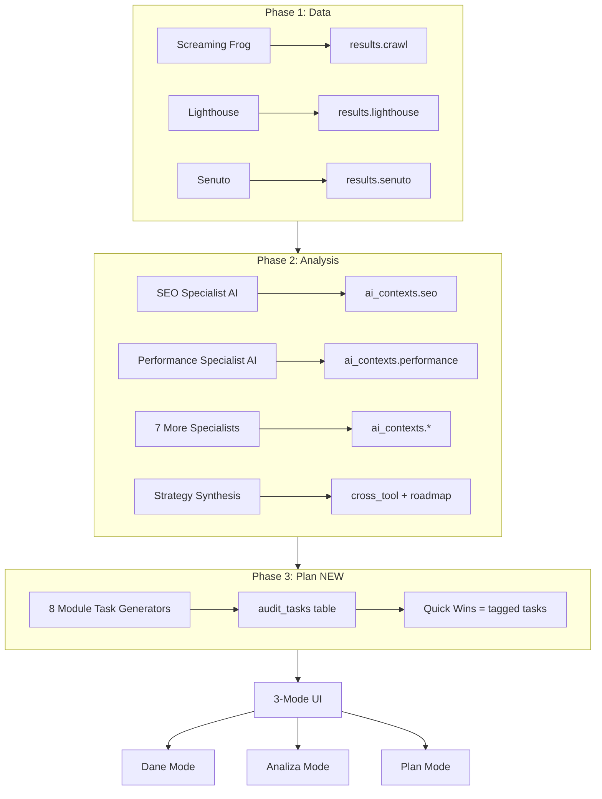

# SiteSpector 3-Phase Audit System

## Quick Overview

SiteSpector now supports a **3-phase audit architecture**:

1. **Dane (Data)** - Raw technical data from tools (Screaming Frog, Lighthouse, Senuto)
2. **Analiza (Analysis)** - Deep AI-powered insights from specialist agents per module
3. **Plan (Execution)** - Concrete, actionable tasks with implementation instructions

---

## What's New

### Backend
- ✅ **AuditTask model** - Interactive task database table
- ✅ **Phase 3 worker** - Generates 30-80 tasks per audit with concrete fix instructions
- ✅ **8 AI specialist generators** - Per-module task generation (SEO, Performance, Visibility, Links, Images, UX, Security, AIO)
- ✅ **Task API** - CRUD endpoints for task management
- ✅ **Auto quick-win tagging** - High impact + easy effort tasks automatically flagged

### Frontend
- ✅ **ModeSwitcher** - 3-segment control (Dane | Analiza | Plan) with color-coding
- ✅ **AnalysisView** - Full-width AI insights (replaces cramped sidebar)
- ✅ **TaskListView** - Interactive task list with filters, search, priority grouping
- ✅ **TaskCard** - Expandable tasks with status toggle, notes, code snippets
- ✅ **Quick Wins page** - Task-based filtered view
- ✅ **Audit creation** - Toggle for execution plan generation

---

## Key Documents

| Document | Purpose |
|----------|---------|
| **3_PHASE_IMPLEMENTATION_SUMMARY.md** | Complete technical summary of what was built |
| **IMPLEMENTATION_GUIDE_3_PHASE.md** | Step-by-step guide for refactoring module pages |
| **3_PHASE_DEPLOYMENT_CHECKLIST.md** | Deployment steps, testing, and troubleshooting |
| `.context7/decisions/DECISIONS_LOG.md` | ADR-008 architectural decision record |

---

## Quick Start

### 1. Deploy to VPS

```bash
# SSH to VPS
ssh root@77.42.79.46

# Pull code
cd /opt/sitespector
git pull origin release

# Apply migration
docker exec sitespector-backend alembic upgrade head

# Restart services
docker compose restart backend worker frontend
```

### 2. Test Phase 3

1. Create new audit with both toggles enabled
2. Wait for completion (~5-10 minutes)
3. Check tasks created:
   ```sql
   SELECT COUNT(*) FROM audit_tasks WHERE audit_id = 'YOUR_AUDIT_ID';
   ```
4. Visit `/audits/{id}/quick-wins` to see tasks

### 3. Complete Module Refactoring

Follow `IMPLEMENTATION_GUIDE_3_PHASE.md` to refactor all 8 module pages (8-12 hours).

---

## Architecture Overview



---

## Example Task Output

### SEO Module - Meta Title Task

```json
{
  "title": "Optymalizacja meta title strony głównej",
  "description": "Obecny title jest za długi (78 znaków) i nie zawiera głównego słowa kluczowego. Zoptymalizuj do 50-60 znaków z keyword na początku.",
  "category": "technical",
  "priority": "high",
  "impact": "high",
  "effort": "easy",
  "is_quick_win": true,
  "fix_data": {
    "current_value": "Bardzo długi tytuł strony który nie jest zoptymalizowany pod SEO i zawiera za dużo słów",
    "suggested_value": "Słowo Kluczowe - Krótki Opis | Nazwa Firmy",
    "code_snippet": "<title>Słowo Kluczowe - Krótki Opis | Nazwa Firmy</title>"
  }
}
```

### Performance Module - LCP Optimization Task

```json
{
  "title": "Optymalizacja LCP - preload hero image",
  "description": "LCP wynosi 3.2s (target: <2.5s). Główny element to hero image. Dodaj preload i zmień format na WebP.",
  "category": "technical",
  "priority": "critical",
  "impact": "high",
  "effort": "medium",
  "is_quick_win": false,
  "fix_data": {
    "current_value": "LCP: 3200ms",
    "suggested_value": "LCP: <2500ms",
    "code_snippet": "<link rel=\"preload\" as=\"image\" href=\"/hero.webp\" fetchpriority=\"high\">\n"
  }
}
```

---

## UI Flow

### Creating Audit with Full Pipeline

1. User clicks "Nowy Audyt"
2. Form shows:
   - ✅ Uruchom analizę AI automatycznie (default: ON)
   - ✅ Wygeneruj plan wykonania automatycznie (default: ON)
3. Submit → Audit created with `status: pending`
4. Worker picks up audit:
   - Phase 1: ~2-3 minutes (crawl + lighthouse + senuto)
   - Phase 2: ~1-2 minutes (AI analysis - 7 contexts + strategy)
   - Phase 3: ~30-60 seconds (8 task generators + synthesis)
5. Audit complete with 30-80 tasks in database

### Viewing Results (Per Module)

User navigates to `/audits/{id}/seo`:

**[Dane] [Analiza] [Plan]** ← Mode switcher

- **Dane mode (blue accent):**
  - Overview metrics (cards, charts)
  - RAW data tables from Screaming Frog
  
- **Analiza mode (purple accent):**
  - Key Findings (bullet points)
  - Priority Issues (highlighted)
  - Quick Wins preview (3-5 items)
  - Recommendations (detailed)
  
- **Plan mode (green accent):**
  - 5-15 tasks for this module
  - Grouped by priority (Critical → High → Medium → Low)
  - Each task has:
    - ✅ Checkbox (toggle done/pending)
    - 📝 Title + Description
    - 🏷️ Priority, Impact, Effort badges
    - 🔥 Quick Win badge (if applicable)
    - 📂 Expandable: Current value, Suggested value, Code snippet, Notes field

### Quick Wins Aggregation

User navigates to `/audits/{id}/quick-wins`:

- Shows ALL quick wins from all 8 modules
- Grouped by module (SEO, Performance, Visibility, etc.)
- Same interactive features (status, notes)
- Flame icon badges
- Stats: Total quick wins, Pending, Done

---

## Task Types by Module

### SEO (5-12 tasks)
- Meta title rewrites (with suggested text)
- Meta description optimization
- Schema JSON-LD generation (ready-to-paste code)
- Canonical tag fixes
- Sitemap creation/updates
- H1 structure optimization

### Performance (5-10 tasks)
- LCP optimization (preload, lazy loading)
- CLS fixes (reserve space, font-display)
- Image compression (specific files, target sizes)
- Render-blocking resources (defer scripts)
- TTFB optimization (caching, CDN)

### Visibility (5-10 tasks)
- Keyword targeting (which keywords on which pages)
- Content gap filling (new content ideas)
- Position improvement strategies (TOP10 → TOP3)
- Internal linking for rankings

### Links (3-8 tasks)
- Broken link fixes (redirect 301 instructions)
- Internal linking map (which pages to link)
- Anchor text optimization
- Orphan page connections

### Images (3-6 tasks)
- Specific ALT text suggestions per image
- Compression parameters (WebP, quality 80)
- Lazy loading implementation
- Format conversions

### UX (3-5 tasks)
- Accessibility fixes (ARIA labels, contrast)
- Mobile optimization
- Touch target sizes

### Security (2-5 tasks)
- HTTPS implementation
- Security headers (CSP, HSTS, X-Frame-Options)
- Mixed content fixes

### AI Overviews (3-8 tasks)
- Content rewrites for AIO presence
- FAQ schema implementation
- How-to content creation

---

## API Usage Examples

### Frontend: Fetch and Display Tasks

```typescript
// In module page (e.g., SEO)
const { data: tasksResponse } = useQuery({
  queryKey: ['tasks', auditId, 'seo'],
  queryFn: () => auditsAPI.getTasks(auditId, { module: 'seo' })
})

const tasks = tasksResponse?.items || []

// Display with TaskListView
<TaskListView
  tasks={tasks}
  module="seo"
  onStatusChange={handleStatusChange}
  onNotesChange={handleNotesChange}
/>
```

### Toggle Task Status

```typescript
const handleStatusChange = async (taskId: string, status: 'pending' | 'done') => {
  await auditsAPI.updateTask(auditId, taskId, { status })
  refetchTasks()
  toast.success('Zaktualizowano zadanie')
}
```

### Get Quick Wins Only

```typescript
const { data } = useQuery({
  queryKey: ['quick-wins', auditId],
  queryFn: () => auditsAPI.getTasks(auditId, { is_quick_win: true })
})
```

---

## Configuration Options

### Audit Creation

Users can configure Phase 2 and Phase 3 independently:

| Configuration | Phase 1 | Phase 2 | Phase 3 | Use Case |
|--------------|---------|---------|---------|----------|
| Both enabled (default) | ✅ | ✅ | ✅ | Full audit with tasks |
| Only AI | ✅ | ✅ | ❌ | Analysis without tasks |
| Only Plan | ✅ | ❌ | ✅ | Tasks without deep analysis |
| Data only | ✅ | ❌ | ❌ | Technical data only |

### On-Demand Triggers

If Phase 2 or Phase 3 were skipped, users can trigger them later:

```typescript
// Trigger AI analysis
await auditsAPI.runAi(auditId)

// Trigger execution plan
await auditsAPI.runExecutionPlan(auditId)
```

---

## Current Status

### ✅ Complete (Production Ready)
- Database schema and migration
- Backend API (all endpoints)
- Worker Phase 3 integration
- Frontend core components
- Quick Wins page transformation
- Audit creation form
- API client and types
- Documentation and guides

### ⏳ In Progress (8-12 hours)
- Module page refactoring (8 modules)
  - Pattern is fully documented
  - All components are ready
  - Mechanical application needed

### 📋 Optional (Future)
- Dashboard global tasks view
- AI Strategy page enhancement
- Task export (CSV/PDF)
- Task assignments (team feature)

---

## Files Changed Summary

### New Files (11)
- `backend/alembic/versions/20260214_add_audit_tasks_table.py`
- `backend/app/routers/tasks.py`
- `backend/app/services/ai_execution_plan.py`
- `frontend/components/audit/ModeSwitcher.tsx`
- `frontend/components/audit/AnalysisView.tsx`
- `frontend/components/audit/TaskListView.tsx`
- `frontend/components/audit/TaskCard.tsx`
- `frontend/components/audit/QuickWinBadge.tsx`
- `frontend/components/ui/textarea.tsx`
- `IMPLEMENTATION_GUIDE_3_PHASE.md`
- `3_PHASE_IMPLEMENTATION_SUMMARY.md`
- `3_PHASE_DEPLOYMENT_CHECKLIST.md`

### Modified Files (8)
- `backend/app/models.py` - AuditTask model, Audit updates
- `backend/app/schemas.py` - Task schemas
- `backend/app/main.py` - Tasks router registration
- `backend/app/routers/audits.py` - run-execution-plan endpoint
- `backend/worker.py` - Phase 3 integration
- `frontend/lib/api.ts` - Task API functions
- `frontend/components/NewAuditDialog.tsx` - Execution plan toggle
- `frontend/app/(app)/audits/[id]/quick-wins/page.tsx` - Task-based view
- `.context7/decisions/DECISIONS_LOG.md` - ADR-008

### To Be Modified (8 modules)
- `frontend/app/(app)/audits/[id]/seo/page.tsx`
- `frontend/app/(app)/audits/[id]/performance/page.tsx`
- `frontend/app/(app)/audits/[id]/visibility/page.tsx`
- `frontend/app/(app)/audits/[id]/ai-overviews/page.tsx`
- `frontend/app/(app)/audits/[id]/links/page.tsx`
- `frontend/app/(app)/audits/[id]/images/page.tsx`
- `frontend/app/(app)/audits/[id]/ux-check/page.tsx`
- `frontend/app/(app)/audits/[id]/security/page.tsx`

---

## Deployment

### Prerequisites
- VPS access
- Git branch merged to `release`
- Database backup created

### Deploy

```bash
ssh root@77.42.79.46
cd /opt/sitespector
git pull origin release
docker exec sitespector-backend alembic upgrade head
docker compose restart backend worker frontend
```

### Verify

```bash
# Check migration
docker exec sitespector-postgres psql -U sitespector_user -d sitespector_db -c "\d audit_tasks"

# Check services
docker ps
docker logs sitespector-worker --tail 50
```

---

## Development Workflow

### After Module Refactoring

1. **Local development:**
   - Modify module page following guide
   - Test all 3 modes
   - Verify task interactions

2. **Deploy to VPS:**
   - Push to git
   - Pull on VPS
   - Restart frontend: `docker compose restart frontend`

3. **Test in production:**
   - Create test audit
   - Navigate to refactored module
   - Test mode switching, task toggling

---

## Next Steps

### Immediate
1. ✅ Deploy backend changes (migration + API)
2. ✅ Test Phase 3 task generation
3. ⏳ Refactor 8 module pages (follow `IMPLEMENTATION_GUIDE_3_PHASE.md`)

### Short Term
- Gather user feedback on task quality
- Adjust AI prompts based on feedback
- Fine-tune quick win criteria

### Long Term
- Dashboard global tasks view
- Task assignment to team members
- Task export (CSV/PDF)
- AI Strategy page enhancement

---

## Support

### Questions?
- Check `IMPLEMENTATION_GUIDE_3_PHASE.md` for module refactoring pattern
- Check `3_PHASE_IMPLEMENTATION_SUMMARY.md` for technical details
- Check `3_PHASE_DEPLOYMENT_CHECKLIST.md` for testing procedures

### Issues?
- Backend errors: Check `docker logs sitespector-worker`
- Frontend errors: Check browser console
- Database issues: Check `.context7/infrastructure/DATABASE.md`

---

**Version:** 1.0  
**Created:** 2026-02-14  
**Status:** Core complete, module refactoring documented  
**Maintainer:** Dawid
