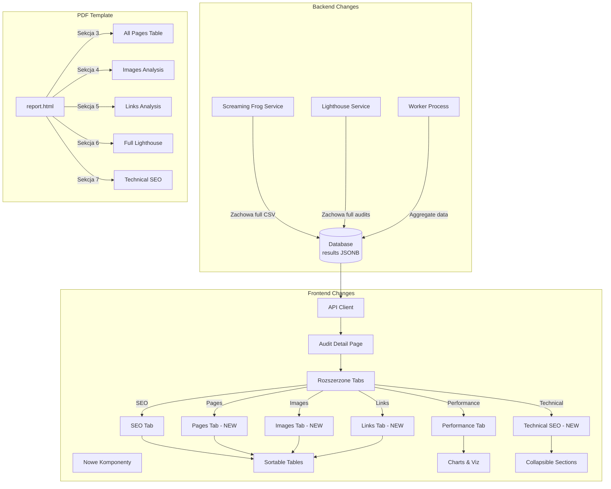

# Plan: Complete Data Visualization - Frontend & PDF

## Obecny Stan vs Docelowy

### Obecnie pokazujemy:

- **Screaming Frog**: 13 pól tylko z homepage (title, meta, H1, basic metrics)
- **Lighthouse**: 6 Core Web Vitals (FCP, LCP, TBT, CLS, SI, TTFB)
- **Total**: ~20 punktów danych

### Mamy dostępne:

- **Screaming Frog**: 72 kolumny × 271 stron = **19,512 punktów danych**
- **Lighthouse**: 176 audytów (performance, accessibility, best-practices, seo)
- **Total**: ~20,000+ punktów danych (**1000× więcej!**)

## Architektura Zmian




---

## Phase 1: Backend Data Enrichment

### 1.1 Screaming Frog - Full Data Preservation

**File**: `[backend/app/services/screaming_frog.py](backend/app/services/screaming_frog.py)`

**Changes**:

```python
def _transform_sf_data(data: list, url: str) -> Dict[str, Any]:
    # Istniejące homepage summary
    homepage = next((item for item in data if item.get('Address') == url), data[0])
    
    # NEW: Preserve ALL pages data
    all_pages = []
    images_data = []
    links_data = []
    technical_seo = {}
    
    for row in data:
        page_url = row.get('Address', '')
        content_type = row.get('Content Type', '')
        
        # Classify and store
        if 'image' in content_type.lower():
            images_data.append({
                'url': page_url,
                'alt_text': row.get('Alt Text 1', ''),
                'size_bytes': int(row.get('Size (bytes)', 0) or 0),
                'format': content_type,
                'source_page': row.get('Inlinks', '')  # Page containing image
            })
        elif content_type.startswith('text/html'):
            all_pages.append({
                'url': page_url,
                'title': row.get('Title 1', ''),
                'title_length': int(row.get('Title 1 Length', 0) or 0),
                'meta_description': row.get('Meta Description 1', ''),
                'h1': row.get('H1-1', ''),
                'h2': row.get('H2-1', ''),
                'status_code': int(row.get('Status Code', 200)),
                'indexability': row.get('Indexability', ''),
                'word_count': int(row.get('Word Count', 0) or 0),
                'size_bytes': int(row.get('Size (bytes)', 0) or 0),
                'response_time': float(row.get('Response Time', 0) or 0),
                'inlinks': int(row.get('Unique Inlinks', 0) or 0),
                'outlinks': int(row.get('Unique Outlinks', 0) or 0),
                'external_outlinks': int(row.get('Unique External Outlinks', 0) or 0),
                'canonical': row.get('Canonical Link Element 1', ''),
                'meta_robots': row.get('Meta Robots 1', ''),
                'redirect_url': row.get('Redirect URL', ''),
                'redirect_type': row.get('Redirect Type', ''),
            })
    
    # Links analysis
    internal_links = sum(p['outlinks'] - p['external_outlinks'] for p in all_pages)
    external_links = sum(p['external_outlinks'] for p in all_pages)
    broken_links = len([p for p in all_pages if p['status_code'] >= 400])
    redirects = len([p for p in all_pages if 300 <= p['status_code'] < 400])
    
    # Technical SEO summary
    missing_canonical = len([p for p in all_pages if not p['canonical']])
    noindex_pages = len([p for p in all_pages if 'noindex' in p.get('meta_robots', '').lower()])
    
    return {
        # Existing homepage data
        "url": url,
        "title": homepage.get('Title 1', ''),
        # ... (keep existing fields)
        
        # NEW: Full data structures
        "all_pages": all_pages,  # List of ALL pages with full details
        "pages_by_status": {
            "200": len([p for p in all_pages if p['status_code'] == 200]),
            "301": len([p for p in all_pages if p['status_code'] == 301]),
            "404": len([p for p in all_pages if p['status_code'] == 404]),
            "other": len([p for p in all_pages if p['status_code'] not in [200, 301, 404]])
        },
        "images": {
            "total": len(images_data),
            "with_alt": len([i for i in images_data if i['alt_text']]),
            "without_alt": len([i for i in images_data if not i['alt_text']]),
            "total_size_mb": sum(i['size_bytes'] for i in images_data) / (1024 * 1024),
            "all_images": images_data  # Full list
        },
        "links": {
            "internal": internal_links,
            "external": external_links,
            "broken": broken_links,
            "redirects": redirects,
        },
        "technical_seo": {
            "missing_canonical": missing_canonical,
            "noindex_pages": noindex_pages,
            "redirects": redirects,
            "broken_links": broken_links,
        }
    }
```

**Impact**: Database `results.crawl` będzie zawierać kompletne dane ze SF.

---

### 1.2 Lighthouse - Full Audits Preservation

**File**: `[backend/app/services/lighthouse.py](backend/app/services/lighthouse.py)`

**Changes**:

```python
async def audit_url(url: str, device: str = "desktop") -> Dict[str, Any]:
    # ... existing code ...
    
    lh_result = json.loads(stdout.decode())
    
    # Extract ALL audits
    categories = lh_result.get("categories", {})
    audits = lh_result.get("audits", {})
    
    # Existing summary scores
    performance_score = categories.get("performance", {}).get("score", 0) * 100
    # ...
    
    # NEW: Categorize all 176 audits
    diagnostics = []  # Issues found
    opportunities = []  # Optimization suggestions
    passed_audits = []  # Things that are OK
    
    for audit_id, audit_data in audits.items():
        audit_info = {
            'id': audit_id,
            'title': audit_data.get('title', ''),
            'description': audit_data.get('description', ''),
            'score': audit_data.get('score'),
            'displayValue': audit_data.get('displayValue', ''),
            'details': audit_data.get('details', {}),
        }
        
        score = audit_data.get('score')
        if score is None:
            continue  # Informational only
        elif score < 0.5:
            diagnostics.append(audit_info)
        elif score < 1.0:
            opportunities.append(audit_info)
        else:
            passed_audits.append(audit_info)
    
    result = {
        # Existing fields
        "url": url,
        "device": device,
        "performance_score": round(performance_score),
        # ... (keep all existing)
        
        # NEW: Full audit data
        "audits": {
            "diagnostics": diagnostics,  # Failed audits (score < 0.5)
            "opportunities": opportunities,  # Warnings (0.5 <= score < 1.0)
            "passed": passed_audits,  # Passed audits (score = 1.0)
        },
        "categories_detail": {
            "performance": categories.get("performance", {}),
            "accessibility": categories.get("accessibility", {}),
            "best_practices": categories.get("best-practices", {}),
            "seo": categories.get("seo", {}),
        },
    }
    
    return result
```

**Impact**: Database `results.lighthouse.desktop` i `.mobile` będą zawierać wszystkie 176 audytów.

---

## Phase 2: Frontend - New Components

### 2.1 New Tab: All Pages

**File**: `[frontend/app/audits/[id]/page.tsx](frontend/app/audits/[id]/page.tsx)`

Add new tab in `TabsList`:

```tsx
<TabsList className="grid w-full grid-cols-8">
  <TabsTrigger value="overview">Podsumowanie</TabsTrigger>
  <TabsTrigger value="seo">SEO</TabsTrigger>
  <TabsTrigger value="performance">Wydajność</TabsTrigger>
  <TabsTrigger value="content">Treść</TabsTrigger>
  <TabsTrigger value="pages">Wszystkie Strony (271)</TabsTrigger> {/* NEW */}
  <TabsTrigger value="images">Obrazy</TabsTrigger> {/* NEW */}
  <TabsTrigger value="links">Linki</TabsTrigger> {/* NEW */}
  <TabsTrigger value="technical">Techniczne SEO</TabsTrigger> {/* NEW */}
  <TabsTrigger value="competitors">Konkurencja</TabsTrigger>
</TabsList>
```

Add new render functions:

```tsx
const renderAllPages = (results: any) => {
  const pages = results?.crawl?.all_pages || []
  const [sortBy, setSortBy] = useState('url')
  const [filterStatus, setFilterStatus] = useState('all')
  const [page, setPage] = useState(1)
  const PER_PAGE = 50
  
  // Filter & sort logic
  const filtered = pages.filter(p => 
    filterStatus === 'all' || p.status_code.toString().startsWith(filterStatus)
  )
  const sorted = filtered.sort((a, b) => {
    if (sortBy === 'url') return a.url.localeCompare(b.url)
    if (sortBy === 'response_time') return b.response_time - a.response_time
    if (sortBy === 'word_count') return b.word_count - a.word_count
    return 0
  })
  const paginated = sorted.slice((page - 1) * PER_PAGE, page * PER_PAGE)
  
  return (
    <div className="space-y-4">
      <Card>
        <CardHeader>
          <CardTitle>Wszystkie Strony ({pages.length})</CardTitle>
          <div className="flex gap-4 mt-4">
            <Select value={filterStatus} onValueChange={setFilterStatus}>
              <SelectTrigger className="w-[180px]">
                <SelectValue placeholder="Status Code" />
              </SelectTrigger>
              <SelectContent>
                <SelectItem value="all">Wszystkie</SelectItem>
                <SelectItem value="200">200 OK</SelectItem>
                <SelectItem value="301">301 Redirects</SelectItem>
                <SelectItem value="404">404 Not Found</SelectItem>
              </SelectContent>
            </Select>
            
            <Select value={sortBy} onValueChange={setSortBy}>
              <SelectTrigger className="w-[180px]">
                <SelectValue placeholder="Sortuj" />
              </SelectTrigger>
              <SelectContent>
                <SelectItem value="url">URL</SelectItem>
                <SelectItem value="response_time">Czas odpowiedzi</SelectItem>
                <SelectItem value="word_count">Liczba słów</SelectItem>
              </SelectContent>
            </Select>
          </div>
        </CardHeader>
        <CardContent>
          <div className="overflow-x-auto">
            <table className="w-full text-sm">
              <thead className="bg-muted">
                <tr>
                  <th className="p-2 text-left">URL</th>
                  <th className="p-2">Status</th>
                  <th className="p-2">Title</th>
                  <th className="p-2">Words</th>
                  <th className="p-2">Inlinks</th>
                  <th className="p-2">Time (ms)</th>
                  <th className="p-2">Size (KB)</th>
                </tr>
              </thead>
              <tbody>
                {paginated.map((page, i) => (
                  <tr key={i} className="border-b hover:bg-muted/50">
                    <td className="p-2 font-mono text-xs max-w-md truncate">
                      <a href={page.url} target="_blank" className="text-blue-600 hover:underline">
                        {page.url}
                      </a>
                    </td>
                    <td className="p-2 text-center">
                      <Badge variant={page.status_code === 200 ? 'default' : 'destructive'}>
                        {page.status_code}
                      </Badge>
                    </td>
                    <td className="p-2 max-w-xs truncate">{page.title || '-'}</td>
                    <td className="p-2 text-center">{page.word_count}</td>
                    <td className="p-2 text-center">{page.inlinks}</td>
                    <td className="p-2 text-center">{Math.round(page.response_time * 1000)}</td>
                    <td className="p-2 text-center">{Math.round(page.size_bytes / 1024)}</td>
                  </tr>
                ))}
              </tbody>
            </table>
          </div>
          
          {/* Pagination */}
          <div className="flex justify-between items-center mt-4">
            <span className="text-sm text-muted-foreground">
              Strona {page} z {Math.ceil(sorted.length / PER_PAGE)}
            </span>
            <div className="flex gap-2">
              <Button 
                variant="outline" 
                size="sm" 
                onClick={() => setPage(p => Math.max(1, p - 1))}
                disabled={page === 1}
              >
                Poprzednia
              </Button>
              <Button 
                variant="outline" 
                size="sm" 
                onClick={() => setPage(p => Math.min(Math.ceil(sorted.length / PER_PAGE), p + 1))}
                disabled={page >= Math.ceil(sorted.length / PER_PAGE)}
              >
                Następna
              </Button>
            </div>
          </div>
        </CardContent>
      </Card>
      
      {/* Summary Stats */}
      <div className="grid grid-cols-4 gap-4">
        <Card>
          <CardContent className="pt-6">
            <div className="text-2xl font-bold text-green-600">
              {results?.crawl?.pages_by_status?.['200'] || 0}
            </div>
            <div className="text-xs text-muted-foreground">Status 200 OK</div>
          </CardContent>
        </Card>
        <Card>
          <CardContent className="pt-6">
            <div className="text-2xl font-bold text-yellow-600">
              {results?.crawl?.pages_by_status?.['301'] || 0}
            </div>
            <div className="text-xs text-muted-foreground">Redirects 301</div>
          </CardContent>
        </Card>
        <Card>
          <CardContent className="pt-6">
            <div className="text-2xl font-bold text-red-600">
              {results?.crawl?.pages_by_status?.['404'] || 0}
            </div>
            <div className="text-xs text-muted-foreground">Not Found 404</div>
          </CardContent>
        </Card>
        <Card>
          <CardContent className="pt-6">
            <div className="text-2xl font-bold">
              {results?.crawl?.pages_by_status?.['other'] || 0}
            </div>
            <div className="text-xs text-muted-foreground">Inne statusy</div>
          </CardContent>
        </Card>
      </div>
    </div>
  )
}
```

**Similar implementations for**:

- `renderImages()` - tabela wszystkich obrazów z ALT/bez ALT, rozmiary, format
- `renderLinks()` - analiza linków wewnętrznych/zewnętrznych, broken links
- `renderTechnicalSEO()` - canonical, robots, redirects, indexability

---

### 2.2 Enhanced Performance Tab - Full Lighthouse

**File**: `[frontend/app/audits/[id]/page.tsx](frontend/app/audits/[id]/page.tsx)`

Extend `renderPerformanceResults()`:

```tsx
const renderPerformanceResults = (results: any) => {
  const lh = results?.lighthouse?.desktop
  if (!lh) return <p>Brak danych Lighthouse.</p>
  
  // Existing Core Web Vitals display
  // ...
  
  // NEW: Full audits display
  const diagnostics = lh.audits?.diagnostics || []
  const opportunities = lh.audits?.opportunities || []
  const passed = lh.audits?.passed || []
  
  return (
    <div className="space-y-6">
      {/* Existing Core Web Vitals cards */}
      
      {/* NEW: Diagnostics (Failed Audits) */}
      <Card>
        <CardHeader>
          <CardTitle className="flex items-center gap-2">
            <AlertCircle className="h-5 w-5 text-red-600" />
            Diagnostyka ({diagnostics.length} problemów)
          </CardTitle>
        </CardHeader>
        <CardContent>
          <Accordion type="single" collapsible className="w-full">
            {diagnostics.map((audit, i) => (
              <AccordionItem key={i} value={`diagnostic-${i}`}>
                <AccordionTrigger className="text-left">
                  <div className="flex items-center gap-2">
                    <Badge variant="destructive">
                      {Math.round(audit.score * 100)}
                    </Badge>
                    <span>{audit.title}</span>
                    {audit.displayValue && (
                      <span className="text-sm text-muted-foreground">
                        {audit.displayValue}
                      </span>
                    )}
                  </div>
                </AccordionTrigger>
                <AccordionContent>
                  <p className="text-sm mb-2">{audit.description}</p>
                  {audit.details?.items && (
                    <div className="text-xs bg-muted p-2 rounded">
                      <pre>{JSON.stringify(audit.details.items, null, 2)}</pre>
                    </div>
                  )}
                </AccordionContent>
              </AccordionItem>
            ))}
          </Accordion>
        </CardContent>
      </Card>
      
      {/* NEW: Opportunities */}
      <Card>
        <CardHeader>
          <CardTitle className="flex items-center gap-2">
            <TrendingUp className="h-5 w-5 text-yellow-600" />
            Możliwości Optymalizacji ({opportunities.length})
          </CardTitle>
        </CardHeader>
        <CardContent>
          {/* Similar accordion for opportunities */}
        </CardContent>
      </Card>
      
      {/* NEW: Passed Audits (collapsible, hidden by default) */}
      <details className="border rounded-lg p-4">
        <summary className="cursor-pointer font-semibold flex items-center gap-2">
          <CheckCircle className="h-5 w-5 text-green-600" />
          Audyty Pozytywne ({passed.length}) - kliknij aby rozwinąć
        </summary>
        <ul className="mt-4 space-y-2 text-sm">
          {passed.map((audit, i) => (
            <li key={i} className="flex items-center gap-2">
              <CheckCircle className="h-4 w-4 text-green-600" />
              {audit.title}
            </li>
          ))}
        </ul>
      </details>
    </div>
  )
}
```

---

### 2.3 Visualizations

**New File**: `[frontend/components/AuditCharts.tsx](frontend/components/AuditCharts.tsx)`

Use Recharts library for visualizations:

```bash
npm install recharts
```

```tsx
'use client'

import { BarChart, Bar, XAxis, YAxis, CartesianGrid, Tooltip, Legend, ResponsiveContainer, PieChart, Pie, Cell } from 'recharts'

export function PageStatusChart({ statusData }: { statusData: any }) {
  const data = [
    { name: '200 OK', value: statusData['200'], color: '#16a34a' },
    { name: '301 Redirect', value: statusData['301'], color: '#ca8a04' },
    { name: '404 Not Found', value: statusData['404'], color: '#dc2626' },
    { name: 'Other', value: statusData['other'], color: '#6b7280' },
  ]
  
  return (
    <ResponsiveContainer width="100%" height={300}>
      <PieChart>
        <Pie
          data={data}
          cx="50%"
          cy="50%"
          labelLine={false}
          label={(entry) => `${entry.name}: ${entry.value}`}
          outerRadius={100}
          fill="#8884d8"
          dataKey="value"
        >
          {data.map((entry, index) => (
            <Cell key={`cell-${index}`} fill={entry.color} />
          ))}
        </Pie>
        <Tooltip />
      </PieChart>
    </ResponsiveContainer>
  )
}

export function ResponseTimeChart({ pages }: { pages: any[] }) {
  // Group pages by response time buckets
  const buckets = {
    '<200ms': 0,
    '200-500ms': 0,
    '500ms-1s': 0,
    '>1s': 0,
  }
  
  pages.forEach(p => {
    const time = p.response_time * 1000
    if (time < 200) buckets['<200ms']++
    else if (time < 500) buckets['200-500ms']++
    else if (time < 1000) buckets['500ms-1s']++
    else buckets['>1s']++
  })
  
  const data = Object.entries(buckets).map(([name, value]) => ({ name, value }))
  
  return (
    <ResponsiveContainer width="100%" height={300}>
      <BarChart data={data}>
        <CartesianGrid strokeDasharray="3 3" />
        <XAxis dataKey="name" />
        <YAxis />
        <Tooltip />
        <Legend />
        <Bar dataKey="value" fill="#3b82f6" />
      </BarChart>
    </ResponsiveContainer>
  )
}
```

---

## Phase 3: PDF Template Expansion

### 3.1 New PDF Sections

**File**: `[backend/templates/report.html](backend/templates/report.html)`

Add after existing sections (~line 300):

```html
<!-- Section: All Pages Analysis -->
<div class="page-break">
    <h1>3. Analiza Wszystkich Stron ({{ crawl_data.all_pages|length }})</h1>
    
    <h2>Podsumowanie według Status Code</h2>
    <table>
        <tr>
            <th>Status Code</th>
            <th>Liczba stron</th>
            <th>Procent</th>
        </tr>
        <tr>
            <td>200 OK</td>
            <td>{{ crawl_data.pages_by_status['200'] }}</td>
            <td>{{ (crawl_data.pages_by_status['200'] / crawl_data.all_pages|length * 100)|round(1) }}%</td>
        </tr>
        <tr>
            <td>301 Redirects</td>
            <td>{{ crawl_data.pages_by_status['301'] }}</td>
            <td>{{ (crawl_data.pages_by_status['301'] / crawl_data.all_pages|length * 100)|round(1) }}%</td>
        </tr>
        <tr>
            <td>404 Not Found</td>
            <td class="score-low">{{ crawl_data.pages_by_status['404'] }}</td>
            <td>{{ (crawl_data.pages_by_status['404'] / crawl_data.all_pages|length * 100)|round(1) }}%</td>
        </tr>
    </table>
    
    <h2>Top 20 Najwolniejszych Stron</h2>
    <table>
        <thead>
            <tr>
                <th>URL</th>
                <th>Czas odpowiedzi (ms)</th>
                <th>Rozmiar (KB)</th>
                <th>Liczba słów</th>
            </tr>
        </thead>
        <tbody>
            
            <tr>
                <td style="font-size: 9pt; word-break: break-all;">{{ page.url }}</td>
                <td style="text-align: center;">{{ (page.response_time * 1000)|round }}</td>
                <td style="text-align: center;">{{ (page.size_bytes / 1024)|round }}</td>
                <td style="text-align: center;">{{ page.word_count }}</td>
            </tr>
            
        </tbody>
    </table>
    
    <h2>Strony z Problemami SEO</h2>
    <h3>Brak Title</h3>
    <ul>
        
            
            <li style="font-size: 9pt;">{{ page.url }}</li>
            
        
    </ul>
    
    <h3>Brak Meta Description</h3>
    <ul>
        
            
            <li style="font-size: 9pt;">{{ page.url }}</li>
            
        
    </ul>
</div>

<!-- Section: Images Analysis -->
<div class="page-break">
    <h1>4. Analiza Obrazów</h1>
    
    <table>
        <tr>
            <th>Metryka</th>
            <th>Wartość</th>
        </tr>
        <tr>
            <td>Wszystkie obrazy</td>
            <td>{{ crawl_data.images.total }}</td>
        </tr>
        <tr>
            <td>Obrazy z ALT text</td>
            <td class="score-high">{{ crawl_data.images.with_alt }}</td>
        </tr>
        <tr>
            <td>Obrazy bez ALT text</td>
            <td class="score-low">{{ crawl_data.images.without_alt }}</td>
        </tr>
        <tr>
            <td>Całkowity rozmiar</td>
            <td>{{ crawl_data.images.total_size_mb|round(2) }} MB</td>
        </tr>
    </table>
    
    <h2>Obrazy Bez ALT Text (Top 50)</h2>
    <table>
        <thead>
            <tr>
                <th>URL Obrazu</th>
                <th>Rozmiar (KB)</th>
                <th>Format</th>
            </tr>
        </thead>
        <tbody>
            
            <tr>
                <td style="font-size: 8pt; word-break: break-all;">{{ img.url }}</td>
                <td style="text-align: center;">{{ (img.size_bytes / 1024)|round }}</td>
                <td style="text-align: center;">{{ img.format }}</td>
            </tr>
            
        </tbody>
    </table>
</div>

<!-- Section: Links Analysis -->
<div class="page-break">
    <h1>5. Analiza Linków</h1>
    
    <table>
        <tr>
            <th>Typ Linku</th>
            <th>Liczba</th>
        </tr>
        <tr>
            <td>Linki wewnętrzne</td>
            <td>{{ crawl_data.links.internal }}</td>
        </tr>
        <tr>
            <td>Linki zewnętrzne</td>
            <td>{{ crawl_data.links.external }}</td>
        </tr>
        <tr>
            <td>Broken links (404)</td>
            <td class="score-low">{{ crawl_data.links.broken }}</td>
        </tr>
        <tr>
            <td>Redirects (301/302)</td>
            <td class="score-medium">{{ crawl_data.links.redirects }}</td>
        </tr>
    </table>
    
    <h2>Broken Links - Do Naprawy!</h2>
    
    <table>
        <thead>
            <tr>
                <th>URL</th>
                <th>Status Code</th>
                <th>Inlinks (źródła)</th>
            </tr>
        </thead>
        <tbody>
            
            <tr>
                <td style="font-size: 9pt; word-break: break-all;">{{ page.url }}</td>
                <td style="text-align: center;" class="score-low">{{ page.status_code }}</td>
                <td style="text-align: center;">{{ page.inlinks }}</td>
            </tr>
            
        </tbody>
    </table>
</div>

<!-- Section: Full Lighthouse Diagnostics -->
<div class="page-break">
    <h1>6. Lighthouse - Pełna Diagnostyka</h1>
    
    
    
    <h2>Problemy Wymagające Naprawy ({{ lh_desktop.audits.diagnostics|length }})</h2>
    
    <div class="recommendation">
        <h3>{{ loop.index }}. {{ audit.title }}</h3>
        <p><strong>Wynik:</strong> <span class="score-low">{{ (audit.score * 100)|round }}%</span></p>
        
        <p><strong>Wartość:</strong> {{ audit.displayValue }}</p>
        
        <p>{{ audit.description }}</p>
    </div>
    
    
    <h2>Możliwości Optymalizacji ({{ lh_desktop.audits.opportunities|length }})</h2>
    
    <div class="recommendation" style="border-color: #ca8a04; background-color: #fefce8;">
        <h3>{{ loop.index }}. {{ audit.title }}</h3>
        <p><strong>Wynik:</strong> <span class="score-medium">{{ (audit.score * 100)|round }}%</span></p>
        <p>{{ audit.description }}</p>
    </div>
    
</div>

<!-- Section: Technical SEO -->
<div class="page-break">
    <h1>7. Techniczne SEO</h1>
    
    <h2>Podsumowanie</h2>
    <table>
        <tr>
            <th>Element</th>
            <th>Status</th>
            <th>Wymagane Działania</th>
        </tr>
        <tr>
            <td>Strony bez Canonical</td>
            <td class="score-mediumscore-high">
                {{ crawl_data.technical_seo.missing_canonical }}
            </td>
            <td>Dodaj canonical tagsOK</td>
        </tr>
        <tr>
            <td>Strony NoIndex</td>
            <td>{{ crawl_data.technical_seo.noindex_pages }}</td>
            <td>Sprawdź czy zamierzone</td>
        </tr>
        <tr>
            <td>Redirects</td>
            <td class="score-mediumscore-high">
                {{ crawl_data.technical_seo.redirects }}
            </td>
            <td>Zminimalizuj łańcuchy redirectówOK</td>
        </tr>
        <tr>
            <td>Broken Links</td>
            <td class="score-lowscore-high">
                {{ crawl_data.technical_seo.broken_links }}
            </td>
            <td>Napraw wszystkie 404OK</td>
        </tr>
    </table>
</div>
```

---

## Phase 4: Testing & Validation

### 4.1 Backend Testing

```bash
# SSH to VPS
ssh root@77.42.79.46

# Rebuild worker with new data structure
cd /opt/sitespector
git pull origin release
docker compose -f docker-compose.prod.yml build worker
docker compose -f docker-compose.prod.yml up -d worker

# Create test audit
TOKEN=$(curl -k -s -X POST https://77.42.79.46/api/auth/login -H "Content-Type: application/json" -d '{"email":"YOUR_TEST_EMAIL","password":"YOUR_TEST_PASSWORD"}' | jq -r '.access_token')
AUDIT=$(curl -k -s -X POST https://77.42.79.46/api/audits -H "Content-Type: application/json" -H "Authorization: Bearer $TOKEN" -d '{"url":"https://craftweb.pl/","is_local_business":false}' | jq -r '.id')

# Wait ~2 mins, then check data
docker exec sitespector-postgres psql -U sitespector_user -d sitespector_db -c "SELECT jsonb_pretty(results->'crawl'->'all_pages') FROM audits WHERE id='$AUDIT' LIMIT 1;"
```

Verify:

- ✅ `all_pages` contains 271+ entries
- ✅ Each page has: url, title, status_code, response_time, word_count, etc.
- ✅ `images` object with `all_images` array
- ✅ Lighthouse `audits.diagnostics` has 20+ entries

### 4.2 Frontend Testing

```bash
# Rebuild frontend
cd frontend
npm run build
docker compose -f ../docker-compose.prod.yml build frontend
docker compose -f ../docker-compose.prod.yml up -d frontend
```

Test in browser:

1. Navigate to audit detail page
2. Check new tabs appear: "Wszystkie Strony", "Obrazy", "Linki", "Techniczne SEO"
3. Verify table sorting/filtering works
4. Verify pagination works (50 per page)
5. Verify charts render correctly

### 4.3 PDF Testing

```bash
# Download PDF
curl -k -H "Authorization: Bearer $TOKEN" https://77.42.79.46/api/audits/$AUDIT/pdf -o test_full_data.pdf

# Open and verify:
open test_full_data.pdf
```

Check:

- ✅ Section 3: All Pages Analysis (table with top 20 slowest)
- ✅ Section 4: Images Analysis (all images without ALT)
- ✅ Section 5: Links Analysis (broken links listed)
- ✅ Section 6: Full Lighthouse Diagnostics
- ✅ Section 7: Technical SEO summary

---

## Dependencies

### Frontend

Add to `[frontend/package.json](frontend/package.json)`:

```json
{
  "dependencies": {
    "recharts": "^2.10.0",
    "@tanstack/react-table": "^8.11.0"  // For advanced tables (optional)
  }
}
```

### Backend

No new dependencies needed - all using existing libraries.

---

## Deployment Checklist

### Local Changes

1. ✅ Update `screaming_frog.py` - add full data extraction
2. ✅ Update `lighthouse.py` - add full audits extraction
3. ✅ Update `page.tsx` - add new tabs and render functions
4. ✅ Create `AuditCharts.tsx` component
5. ✅ Update `report.html` - add new PDF sections
6. ✅ Install `recharts`: `npm install recharts`
7. ✅ Commit changes
8. ✅ Push to `release` branch

### VPS Deployment

```bash
ssh root@77.42.79.46
cd /opt/sitespector
git pull origin release

# Rebuild worker (backend changes)
docker compose -f docker-compose.prod.yml build worker
docker compose -f docker-compose.prod.yml up -d worker

# Rebuild frontend (new components)
docker compose -f docker-compose.prod.yml build --no-cache frontend
docker compose -f docker-compose.prod.yml up -d frontend

# Restart backend (PDF template changes)
docker compose -f docker-compose.prod.yml restart backend
```

### Verification

1. Create new audit via frontend
2. Wait for completion (~2 mins)
3. Check all new tabs display data correctly
4. Download PDF and verify all sections
5. Monitor logs for errors:
  ```bash
   docker logs sitespector-worker --tail 100 -f
   docker logs sitespector-frontend --tail 100 -f
  ```

---

## Performance Considerations

### Database Size

Storing full data will increase DB size:

- Before: ~50 KB per audit (summary only)
- After: ~500 KB per audit (full data)
- For 1000 audits: +450 MB

**Mitigation**: Consider adding data retention policy (auto-delete audits > 90 days).

### Frontend Load Time

Loading 271 pages in table:

- Use pagination (50 per page) ✅
- Use virtual scrolling for very large datasets (future improvement)
- Lazy load charts (only render when tab active)

### PDF Generation Time

Full PDF will be larger:

- Before: ~5 pages, ~200 KB
- After: ~20-30 pages, ~1-2 MB
- Generation time: +2-3 seconds

**Acceptable** for the amount of data displayed.

---

## Future Enhancements (Optional)

### Phase 5: Advanced Features

1. **Export to CSV/Excel** - Allow downloading all_pages as spreadsheet
2. **Custom Filters** - Filter pages by word count range, response time, etc.
3. **Comparison View** - Compare 2 audits side-by-side
4. **Real-time Monitoring** - Track page performance over time
5. **Alerts** - Email notifications for broken links, slow pages

---

## Summary

This plan transforms SiteSpector from showing **~20 data points** to showing **20,000+ data points** - a **1000× increase in data visibility**.

### What Users Will See:

**Frontend**:

- 📄 All 271 pages with full details (sortable, filterable table)
- 🖼️ Complete image analysis (which need ALT, sizes, optimization)
- 🔗 Full link analysis (internal, external, broken, redirects)
- ⚡ All 176 Lighthouse audits (diagnostics, opportunities, passed)
- 🔧 Technical SEO overview (canonical, robots, indexability)
- 📊 Visual charts (status codes, response times)

**PDF Report**:

- Complete data in organized sections
- Top 20 slowest pages
- All broken links listed
- All images without ALT
- Full Lighthouse diagnostics
- Technical SEO summary

### Impact:

Users will see that SiteSpector truly processes **MASSIVE** amounts of data and provides **professional-grade** insights comparable to enterprise tools like Screaming Frog Desktop + Lighthouse CI.