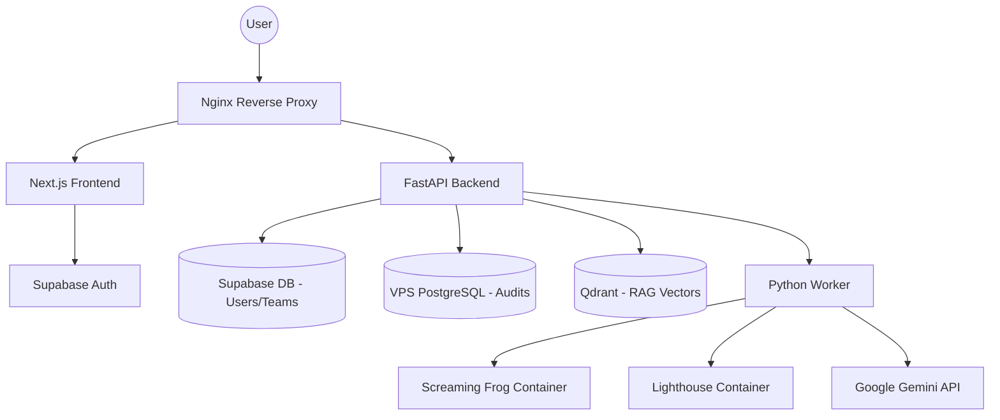

# SiteSpector - System Architecture

## High-Level Architecture
SiteSpector is a containerized microservices application running on a single VPS.

## Dual Database Strategy
- **Supabase PostgreSQL**: Stores user profiles, workspaces, team memberships, and subscriptions. Protected by Row Level Security (RLS).
- **VPS PostgreSQL**: Stores high-volume audit results and competitor data in JSONB format for fast worker access.

## Container Services
1. **nginx**: Handles SSL termination (Let's Encrypt) and routing.
2. **frontend**: Next.js 14 standalone build.
3. **backend**: FastAPI REST API.
4. **worker**: Background processor for audits.
5. **postgres**: Local audit database.
6. **qdrant**: Vector store for audit-scoped RAG chat.
7. **screaming-frog**: Headless SEO crawler.
8. **lighthouse**: Performance auditing engine.

---
## Frontend Layout Notes (App UX)

The authenticated app has a persistent right-side ChatPanel (desktop) which reduces the available width of the main content area.

**Important UI decision**:
- The scrollable content area (`frontend/app/(app)/layout.tsx` → `<main>`) is marked as a CSS container (`@container`)
- App pages use Tailwind container-query utilities (`@md:`, `@lg:`, `@xl:`) so the layout adapts to the *content container width*, not just the viewport width

This avoids "squished" grids/cards when the chat is open by default.

---
**Last Updated**: 2026-02-16
