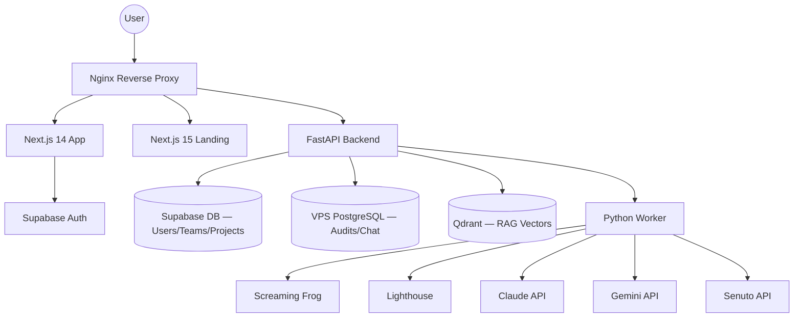

# SiteSpector — Architecture & Overview

## Project Identity

**Type**: Professional SEO & Technical Audit Platform (SaaS)
**Market**: Polish B2B (agencies, freelancers, website owners)
**Status**: Production — Teams, Billing, Workspaces fully operational
**Domain**: sitespector.app | **VPS**: 46.225.134.48 (Hetzner, CPX42)

## Core Features

- **SEO Crawling** — Screaming Frog (headless, commercial license v19.4)
- **Performance Testing** — Lighthouse (Core Web Vitals, desktop + mobile)
- **AI Analysis** — Claude (contextual analysis) + Gemini (embeddings, content)
- **RAG Chat** — Qdrant vector store, per-audit semantic chunking, SSE streaming
- **PDF Reports** — WeasyPrint, 43-section professional audits
- **Competitive Analysis** — up to 3 competitors per project
- **Senuto Integration** — Visibility, backlinks, keyword positions, AI Overviews
- **Team Workspaces** — role-based access (owner/admin/member), multi-tenancy
- **Subscription Billing** — Free / Pro / Enterprise tiers (Stripe)
- **Landing** — 18+ marketing pages (Polish), 23 blog posts, 4 case studies

---

## High-Level Architecture



## Dual Database Strategy

| DB | Tables | Notes |
|----|--------|-------|
| **Supabase PostgreSQL** | `profiles`, `workspaces`, `workspace_members`, `invites`, `projects`, `project_members`, `subscriptions`, `invoices` | RLS policies, auth triggers, auto-signup |
| **VPS PostgreSQL** | `users`, `audits`, `competitors`, `audit_tasks`, `audit_schedules`, `agent_types`, `chat_conversations`, `chat_messages`, `chat_attachments`, `chat_message_feedback`, `chat_shares`, `chat_usage`, `contact_submissions`, `newsletter_subscribers` | High-volume JSONB, async via asyncpg |

## Container Services (Docker Compose — Production)

| # | Service | Role |
|---|---------|------|
| 1 | **nginx** | SSL termination (Let's Encrypt), reverse proxy, rate limiting |
| 2 | **frontend** | Next.js 14 standalone build (port 3000) |
| 3 | **landing** | Next.js 15 marketing site (port 3001, mem_limit: 512m) |
| 4 | **backend** | FastAPI REST API (port 8000) |
| 5 | **worker** | Background 3-phase audit processor |
| 6 | **postgres** | PostgreSQL 16-alpine (VPS audit database) |
| 7 | **qdrant** | Qdrant v1.13.2 vector store for RAG chat |
| 8 | **screaming-frog** | Headless SEO crawler (Ubuntu + Java + Xvfb) |
| 9 | **lighthouse** | Performance auditing (Node 20 + Chromium) |
| 10 | **dozzle** | Docker log viewer (SSH tunnel only, not public) |

Networks: `sitespector-internal` (DB, backend, worker) + `sitespector-external` (nginx, crawlers).

---

## Technology Stack

### Backend
- **Framework**: FastAPI (Python 3.11)
- **ORM**: SQLAlchemy 2.0 (async, asyncpg driver)
- **Auth**: Supabase Auth (JWT verification)
- **AI**: Claude (contextual analysis, `claude-sonnet-4-20250514`) + Gemini (embeddings, content)
- **Billing**: Stripe (webhooks, checkout sessions)
- **PDF**: Jinja2 templates (43 sections) + WeasyPrint
- **Routers**: auth, audits, projects, chat, tasks, schedules, billing, public, admin

### Frontend (App)
- **Framework**: Next.js 14 (App Router)
- **Language**: TypeScript (strict mode)
- **Styling**: Tailwind CSS + shadcn/ui (Radix primitives)
- **State**: TanStack Query (server) + Zustand (UI/chat)
- **Charts**: Recharts + react-force-graph-2d
- **Theme**: next-themes (dark mode)

### Landing
- **Framework**: Next.js 15 (React 19)
- **Styling**: Bootstrap 5 + SCSS
- **Content**: Markdown files (gray-matter + remark)

---

## Three-Phase Audit Pipeline

```
Phase 1: Technical Analysis
  Screaming Frog crawl → Lighthouse (desktop + mobile) → Senuto (visibility, backlinks, AIO)
  → Competitor analysis → Technical SEO extras (schema, robots, sitemap, soft-404, semantic HTML)
  → Calculate scores + health indices → Save partial results

Phase 2: AI Analysis
  Content → Performance → UX → Security → Local SEO → Tech stack
  → Per-area contextual analyses (13 areas) → Cross-tool validation
  → Roadmap + executive summary → Quick wins aggregation → RAG indexing

Phase 3: Execution Plan
  Generate tasks per module (SEO, Performance, Visibility, AIO, Links, Images, UX, Security)
  → Persist to audit_tasks → Mark execution_plan_status = COMPLETED
```

---

## Critical UX Flow (enforced)

```
Register → Workspace auto-created (Supabase trigger)
  ↓
Dashboard (workspace trends — READ ONLY, no audit creation)
  ↓
/projects — create project (one per website)
  ↓
/projects/[id] — project view → create audit here
  ↓
/audits/[id] — audit detail (28+ subpages)
```

> **NEVER create audits without `project_id`** — UI enforces project-first flow.

---

## Frontend Layout Notes

The authenticated app has a persistent right-side **ChatPanel** (desktop, default 360px) which narrows the main content area.

- `frontend/app/(app)/layout.tsx` → `<main>` uses `min-w-0`, `overflow-x-hidden`, CSS `@container`
- App pages use container-query utilities (`@md:`, `@lg:`, `@xl:`) — NOT viewport `md:`
- Shared branding via `frontend/components/brand/SiteSpectorLogo.tsx`

---

## Key Module Map

| Module | Location | Notes |
|--------|----------|-------|
| Layout + Nav | `frontend/components/layout/` | TopBar, Breadcrumbs, UserMenu, MobileMenu, AuditSidebar, ProjectSidebar |
| Dashboard | `frontend/app/(app)/dashboard/` | Workspace trends only |
| Projects | `frontend/app/(app)/projects/` | CRUD, audits, compare, schedule, team |
| Audit detail | `frontend/app/(app)/audits/[id]/` | 28+ subpages (seo, technical, performance, schema, ai-readiness, visibility, backlinks, etc.) |
| Settings | `frontend/app/(app)/settings/` | profile, team, billing, agents, schedules, appearance, notifications |
| Admin | `frontend/app/(app)/admin/` | users, workspaces, audits, system status |
| Chat (RAG) | `frontend/components/chat/` | AgentSelector, ChatPanel, ChatInput, ChatMessages, SSE streaming |
| Backend routers | `backend/app/routers/` | auth, audits, projects, chat, tasks, schedules, billing, public, admin |
| Backend services | `backend/app/services/` | 16 services (screaming_frog, lighthouse, senuto, ai_analysis, rag_service, pdf, health_index, etc.) |
| Worker | `backend/worker.py` | 3-phase pipeline: technical → AI → execution plan |

---

## Known Gotchas

1. **No local Docker** — all containers run on VPS only. SSH tunnel for Dozzle.
2. `project_id` is nullable in DB but must be provided at UI level — legacy audits may have NULL.
3. `audits.user_id` = legacy field; `workspace_id` + `project_id` are canonical.
4. Supabase RLS: policies in `supabase/policies.sql` — avoid recursive policies.
5. Frontend workspace switch triggers `window.location.reload()` — all state resets.
6. Landing uses Next.js 15 + Bootstrap; Frontend uses Next.js 14 + Tailwind — different stacks.

---
**Last updated**: 2026-03-17
