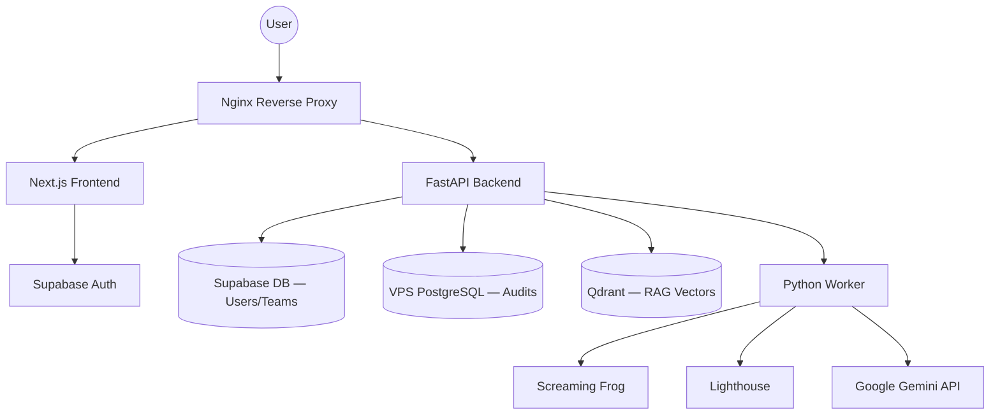
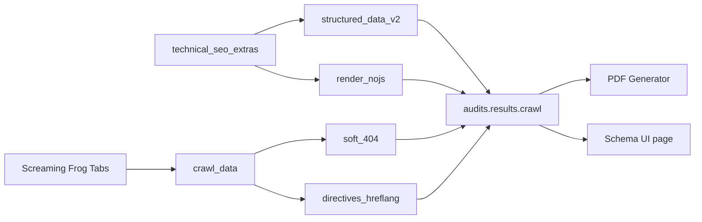

# SiteSpector — Architecture & Overview

## Project Identity

**Type**: Professional SEO & Technical Audit Platform (SaaS)  
**Market**: Polish B2B (agencies, freelancers, website owners)  
**Status**: Production — Teams, Billing, Workspaces fully operational  
**Domain**: sitespector.app | **VPS**: 46.225.134.48 (Hetzner, CPX42)  

## Core Features

- **SEO Crawling** — Screaming Frog (headless, commercial license)
- **Performance Testing** — Lighthouse (Core Web Vitals, page speed)
- **AI Analysis** — Google Gemini 1.5 Flash (content quality, recommendations)
- **RAG Chat** — Qdrant vector store, semantic chunking, SSE streaming
- **PDF Reports** — WeasyPrint, professional downloadable audits
- **Competitive Analysis** — up to 3 competitors per project
- **Team Workspaces** — role-based access, multi-tenancy
- **Subscription Billing** — Free / Pro / Enterprise tiers (Stripe)
- **Landing** — 18+ marketing pages (Polish), blog, case studies, legal, SEO

---

## High-Level Architecture



## Dual Database Strategy

| DB | Tables | Notes |
|----|--------|-------|
| **Supabase PostgreSQL** | `workspaces`, `workspace_members`, `projects`, `project_members`, `subscriptions`, `profiles` | RLS policies, auth.users |
| **VPS PostgreSQL** | `audits`, `competitors`, `audit_schedules`, `chat_*`, `agent_types` | High-volume JSONB, async via asyncpg |

## Container Services (Docker Compose)

| # | Service | Role |
|---|---------|------|
| 1 | **nginx** | SSL termination (Let's Encrypt), reverse proxy |
| 2 | **frontend** | Next.js 14 standalone build |
| 3 | **landing** | Next.js marketing site (mem_limit: 512m) |
| 4 | **backend** | FastAPI REST API |
| 5 | **worker** | Background audit processor |
| 6 | **postgres** | Local VPS audit database |
| 7 | **qdrant** | Vector store for RAG chat |
| 8 | **screaming-frog** | Headless SEO crawler |
| 9 | **lighthouse** | Performance auditing engine |
| 10 | **dozzle** | Docker log viewer (SSH tunnel only, not public) |

---

## Technology Stack

### Backend
- **Framework**: FastAPI (Python 3.11)
- **ORM**: SQLAlchemy 2.0 (async)
- **Auth**: Supabase Auth (JWT verification)
- **AI**: Google Gemini API (`gemini-1.5-flash`)
- **Billing**: Stripe
- **PDF**: WeasyPrint

### Frontend
- **Framework**: Next.js 14 (App Router)
- **Language**: TypeScript (strict mode)
- **Styling**: Tailwind CSS + shadcn/ui
- **State**: TanStack Query (server) + Zustand (UI/chat)
- **Theme**: next-themes (dark mode)

---

## Critical UX Flow (enforced)

```
Register → Workspace auto-created
  ↓
Dashboard (trends — READ ONLY, no audit creation)
  ↓
/projects — create project
  ↓
/projects/[id] — project view → create audit here
  ↓
/audits/[id] — audit detail (15+ subpages)
```

> **NEVER create audits without `project_id`** — UI enforces project-first flow.  
> `PATCH /api/audits/{id}/assign-project` exists to migrate orphaned legacy audits.

---

## Frontend Layout Notes

The authenticated app has a persistent right-side **ChatPanel** (desktop) which narrows the main content area.

- `frontend/app/(app)/layout.tsx` → `<main>` is marked as a CSS `@container`
- App pages use container-query utilities (`@md:`, `@lg:`, `@xl:`) — NOT viewport `md:`
- This prevents "squished" grids/cards when the chat panel is open

---

## Key Module Map

| Module | Location | Notes |
|--------|----------|-------|
| Sidebar | `frontend/components/layout/UnifiedSidebar.tsx` | Projects tree + audit nav + search |
| Dashboard | `frontend/app/(app)/dashboard/page.tsx` | Workspace trends only |
| Projects | `frontend/app/(app)/projects/` | CRUD, audits, compare, schedule, team |
| Audit detail | `frontend/app/(app)/audits/[id]/` | 15+ subpages |
| Chat (RAG) | `frontend/components/chat/ChatPanel.tsx` | SSE streaming, Zustand store |
| Backend API | `backend/app/routers/` | audits, projects, chat, schedules |
| Worker | `backend/app/worker.py` | Screaming Frog + Lighthouse + Gemini |

---

## Schema-first Reporting Flow (2026-03-06)

- Technical extras layer now enriches crawl payload with:
  - `structured_data_v2` (priority-based schema validation + AI readiness),
  - `render_nojs`,
  - `soft_404`,
  - `directives_hreflang`,
  - extended `semantic_html`.
- Worker persists these fields directly in `audits.results.crawl`.
- PDF generator consumes those fields in Part II (Technical SEO), with Schema section rendered before classic on-page sections.
- Frontend exposes schema explicitly via `/audits/[id]/schema` and updated PDF type promises.



---

## Known Gotchas

1. **No local Docker** — all containers run on VPS only. SSH tunnel for Dozzle.
2. `project_id` is nullable in DB but must be provided at UI level — legacy audits may have NULL.
3. `audits.user_id` = legacy field; `workspace_id` + `project_id` are canonical.
4. Supabase RLS: policies in `supabase/policies.sql` — avoid recursive policies.
5. Frontend workspace switch triggers `window.location.reload()` — all state resets.

---
## UI Template Hardening (2026-03-03)

- Authenticated shell now enforces stronger width guardrails: `main` uses `min-w-0` and `overflow-x-hidden` in `frontend/app/(app)/layout.tsx`.
- Persistent ChatPanel default width was reduced from `420` to `360` in `frontend/lib/chat-store.ts` to limit content squeeze.
- Report builder (`frontend/app/(app)/audits/[id]/client-report/page.tsx`) was updated to container-query-first behavior (`@md/@lg`), replacing remaining viewport-only spans and rigid print-like spacing.
- Branding consistency improved by introducing shared logo component `frontend/components/brand/SiteSpectorLogo.tsx` used by app sidebar/public navbar/public footer.
- Landing typography and menu rules were normalized to reduce overflow risks (`landing/src/assets/scss/_general.scss`, `_menu.scss`, `_mega-menu.scss`).
- PDF readability/wrapping was hardened in `backend/app/services/pdf/styles.py` and `backend/templates/pdf/sections/cover.html` (long URLs/tables/project names).
- PDF cover rendering now uses a full-bleed first-page strategy (`@page :first { margin: 0 }` + A4-sized cover block) to prevent white lower bands and footer spillover on client reports.
- Cover design direction was shifted to light theme (dark text on bright background) with deterministic footer placement and optional PNG logo source (`PDF_COVER_LOGO_SRC`) for stable client-facing rendering.

---
**Last updated**: 2026-03-06
