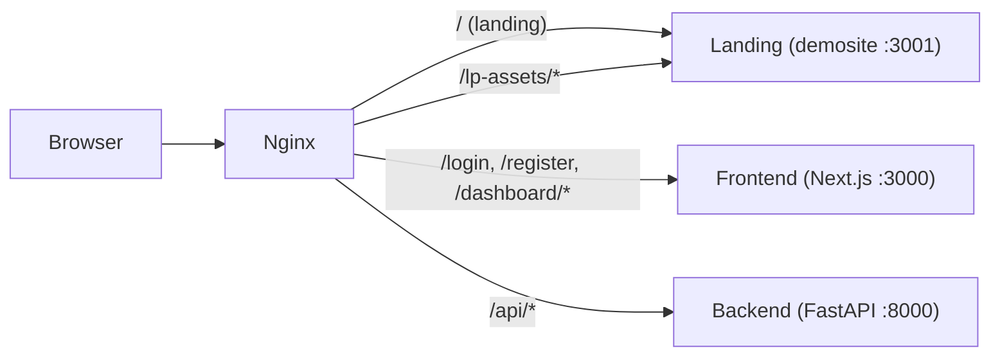

# Wdrożenie Landing Page SiteSpector

## Sytuacja wyjściowa

- **demosite/**: Szablon Loxcy (Next.js 15, React 19, Bootstrap 5, SCSS)
- **frontend/**: Aplikacja SaaS (Next.js 14, React 18, Tailwind, shadcn/ui)
- Dwa kompletnie różne stacki CSS - nie da się ich połączyć w jednym projekcie bez konfliktów
- Obecny `frontend/app/page.tsx` to prosty placeholder

## Podejście: Osobny kontener z routingiem nginx

Landing page działa jako oddzielny serwis Docker. Nginx routuje:

- `/` i assety landing page → kontener `landing`
- `/login`, `/register`, `/dashboard`, `/api/*` → istniejący `frontend` i `backend`

Dzięki temu zero konfliktów CSS, zero zmian w istniejącym frontendzie.




---

## Faza 1: Aktualizacja treści w demosite/ (11 plików)

Wszystkie teksty z [demosite/CONTENT_DRAFT.md](demosite/CONTENT_DRAFT.md).

### 1.1 Topbar (navbar) - [demosite/src/component/layout/Topbar/page.tsx](demosite/src/component/layout/Topbar/page.tsx)

- Zmiana brandu z "LOXCY" na "SiteSpector" (+ zmiana ikony z RiGpsFill na odpowiednią)
- Sekcje nav: `Funkcje`, `Wydajność`, `Cennik`, `FAQ`, `Kontakt`
- Dodanie przycisku "Zaloguj się" (link `/login`) + "Załóż konto" (link `/register`)

### 1.2 Hero - [demosite/src/app/(home)/home-1/Hero.tsx](demosite/src/app/(home)/home-1/Hero.tsx)

- H1: "Zdominuj wyniki wyszukiwania z **SiteSpector**"
- Opis: tekst z CONTENT_DRAFT
- CTA: "Rozpocznij Darmowy Audyt" → `/register`, "Zobacz Demo" → `#about`
- Obraz: podmiana `Dashboard.png` na screenshot z aplikacji SiteSpector

### 1.3 About (features grid) - [demosite/src/component/About.tsx](demosite/src/component/About.tsx)

- Tytuł: "Narzędzia, które napędzają Twój **Wzrost**"
- 6 kafelków: Audyty Techniczne, Analiza Wydajności, Praca Zespołowa, Rekomendacje AI, Monitoring Konkurencji, Raporty PDF

### 1.4 Feature (lista) - [demosite/src/component/Feature.tsx](demosite/src/component/Feature.tsx)

- Tytuł: "Wszystko czego potrzebujesz do **Optymalizacji**"
- Lista: Crawling SEO, Core Web Vitals, Analiza Treści, Zarządzanie Subskrypcjami
- CTA: "Poznaj pełną specyfikację"
- Obraz: podmiana `dashbord-3.png` na screenshot SiteSpector

### 1.5 Services - [demosite/src/component/Services.tsx](demosite/src/component/Services.tsx)

- Tytuł: "Zwiększ widoczność w Google w **Kilka Minut**"
- Liczniki: 200K+, 98%
- Bullet points z CONTENT_DRAFT
- Obraz: podmiana `dashbord-4.png`

### 1.6 Counter - [demosite/src/component/Counter.tsx](demosite/src/component/Counter.tsx)

- 4 statystyki: 500+ Agencji, 150+ Krajów, 1M+ Wykrytych Błędów, 10k+ Zaoszczędzonych Godzin

### 1.7 Pricing - [demosite/src/component/Pricing.tsx](demosite/src/component/Pricing.tsx)

- 3 plany: Free (0 PLN), Pro (199 PLN), Enterprise (499 PLN)
- Cechy z CONTENT_DRAFT
- CTA: "Rozpocznij" → `/register`

### 1.8 FAQ - [demosite/src/component/Faq.tsx](demosite/src/component/Faq.tsx)

- 6 pytań i odpowiedzi z CONTENT_DRAFT

### 1.9 CTA - [demosite/src/component/Cta.tsx](demosite/src/component/Cta.tsx)

- Dane kontaktowe: Warszawa, +48..., [kontakt@sitespector.pl](mailto:kontakt@sitespector.pl)

### 1.10 Footer - [demosite/src/component/layout/Footer/page.tsx](demosite/src/component/layout/Footer/page.tsx)

- Brand: "SiteSpector"
- Kolumny: Produkt, Firma, Wsparcie (linki do sekcji + /login, /register)
- Copyright: "SiteSpector"

### 1.11 Brands - [demosite/src/component/Brands.tsx](demosite/src/component/Brands.tsx)

- Zamiana logotypów na technologie: Google Lighthouse, Screaming Frog, Google Gemini, Supabase, Stripe, Docker
- Lub usunięcie sekcji (do decyzji)

### 1.12 Layout metadata - [demosite/src/app/layout.tsx](demosite/src/app/layout.tsx)

- Title: "SiteSpector - Profesjonalne Audyty SEO i Wydajności"
- Description odpowiednio

---

## Faza 2: Grafiki

### 2.1 Screenshoty z aplikacji SiteSpector

- Potrzebne 3 screenshoty dashboardu/audytu do sekcji Hero, Feature, Services
- Opcja A: Zrobić screenshoty z działającej aplikacji na VPS (najlepsze)
- Opcja B: Tymczasowo zostawić obecne placeholdery (szybsze ASAP)
- Pliki: `demosite/src/assets/images/Dashboard.png`, `dashbord-3.png`, `dashbord-4.png`

### 2.2 Logo technologii (dla sekcji Brands)

- SVG logo: Lighthouse, Gemini, Supabase, itd.
- Umieścić w `demosite/src/assets/images/logo/`

---

## Faza 3: Konfiguracja techniczna demosite

### 3.1 next.config.ts - [demosite/next.config.ts](demosite/next.config.ts)

- Dodać `output: 'standalone'` (dla Docker)
- Dodać `assetPrefix: '/lp-assets'` (unikanie konfliktu `/_next/` z frontendem)
- Dodać `images: { unoptimized: true }` (standalone + reverse proxy)
- Usunąć redirect z `/` → `/home-1`; zamiast tego Home 1 staje się root page

### 3.2 Routing - uproszczenie

- Przenieść zawartość `home-1/page.tsx` jako root page `demosite/src/app/page.tsx`
- Usunąć niepotrzebne warianty (home-2 do home-8, auth)

### 3.3 Dockerfile - NOWY plik `demosite/Dockerfile`

```dockerfile
FROM node:20-alpine AS base
# ... (analogiczny do frontend/Dockerfile)
# multi-stage build, standalone output, port 3001
EXPOSE 3001
ENV PORT 3001
```

---

## Faza 4: Docker Compose i Nginx

### 4.1 docker-compose.prod.yml - dodanie serwisu `landing`

```yaml
landing:
  build:
    context: ./demosite
    dockerfile: Dockerfile
  container_name: sitespector-landing
  command: node server.js
  environment:
    - HOSTNAME=0.0.0.0
    - PORT=3001
  networks:
    - sitespector-network
  restart: unless-stopped
```

### 4.2 nginx.conf - [docker/nginx/nginx.conf](docker/nginx/nginx.conf)

Dodanie routingu dla landing page:

```nginx
upstream landing {
    server landing:3001;
}

# Landing page - root URL
location = / {
    proxy_pass http://landing;
    # standard proxy headers
}

# Landing page assets (assetPrefix: /lp-assets)
location /lp-assets/ {
    rewrite ^/lp-assets(/.*)$ $1 break;
    proxy_pass http://landing;
    proxy_cache_valid 200 60m;
    add_header Cache-Control "public, max-age=3600, immutable";
}

# Everything else stays as-is (frontend, backend, etc.)
```

---

## Faza 5: Commit, Push, Deploy

### 5.1 Commit (lokalnie)

- Jeden commit ze wszystkimi zmianami
- Format: `feat: add SiteSpector landing page with PL content, Docker setup, nginx routing`

### 5.2 Push (po akceptacji)

```bash
git push origin release
```

### 5.3 Deployment na VPS

```bash
ssh root@77.42.79.46
cd /opt/sitespector
git pull origin release

# Build nowego kontenera landing + rebuild nginx
docker compose -f docker-compose.prod.yml build --no-cache landing nginx

# Restart z nowym kontenerem
docker compose -f docker-compose.prod.yml up -d landing
docker compose -f docker-compose.prod.yml restart nginx

# Verify
docker ps | grep sitespector
curl -k https://localhost  # powinien zwrócić landing page
```

### 5.4 Test

- `https://77.42.79.46/` → Landing page (nowa)
- `https://77.42.79.46/login` → Login (istniejący)
- `https://77.42.79.46/register` → Rejestracja (istniejąca)
- `https://77.42.79.46/dashboard` → Dashboard (istniejący)

---

## Ryzyko i mitygacja

- **Konflikt `/_next/**`: Rozwiązany przez `assetPrefix: '/lp-assets'` - landing page ładuje assety z `/lp-assets/_next/`, frontend z `/_next/`
- **RAM na VPS**: Nowy kontener Next.js standalone to ~50-80MB RAM. VPS ma 8GB, powinno starczyć.
- **Grafiki**: Tymczasowo zostawimy obecne dashboardy z szablonu; screenshoty SiteSpector podmienimy w następnym kroku.

