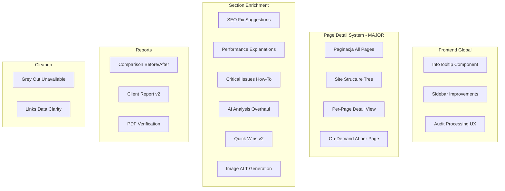

# Plan Wzbogacenia Panelu SiteSpector

## Architektura zmian




---

## Sekcja 1: Global - System Tooltipow i Wyjasnien

**Problem**: Uzytkownik nie wie co oznaczaja metryki, skad pochodza, co jest dobre/zle.

**Rozwiazanie**:

- Stworzyc komponent `InfoTooltip` w `[frontend/components/ui/info-tooltip.tsx](frontend/components/ui/info-tooltip.tsx)` (shadcn Tooltip + ikona `HelpCircle`)
- Stworzyc slownik tooltipow `[frontend/lib/tooltips.ts](frontend/lib/tooltips.ts)` - centralny plik z wszystkimi opisami metryk
- Kazdy tooltip zawiera: **Co to jest**, **Skad pochodzi** (Lighthouse/Screaming Frog/AI), **Co jest dobre** (zakres wartosci)

**Pliki do edycji** (dodanie tooltipow):

- `[frontend/app/(app)/audits/[id]/page.tsx](frontend/app/(app)`/audits/[id]/page.tsx) - Overview scores
- `[frontend/app/(app)/audits/[id]/seo/page.tsx](frontend/app/(app)`/audits/[id]/seo/page.tsx) - SEO metrics
- `[frontend/app/(app)/audits/[id]/performance/page.tsx](frontend/app/(app)`/audits/[id]/performance/page.tsx) - Core Web Vitals
- `[frontend/app/(app)/audits/[id]/ai-analysis/page.tsx](frontend/app/(app)`/audits/[id]/ai-analysis/page.tsx) - AI scores
- Wszystkie pozostale strony audytu

**Przyklad slownika**:

```typescript
export const TOOLTIPS = {
  overall_score: {
    label: "Wynik Ogolny",
    description: "Srednia wazona z SEO (40%), Wydajnosci (30%) i Tresci (30%)",
    source: "Obliczany automatycznie",
    good: "70-100", warning: "40-69", bad: "0-39"
  },
  lcp: {
    label: "Largest Contentful Paint",
    description: "Czas ladowania najwiekszego elementu widocznego na ekranie",
    source: "Google Lighthouse",
    good: "<2.5s", warning: "2.5-4s", bad: ">4s"
  },
  // ... 50+ metryk
}
```

---

## Sekcja 2: Sidebar - System Status + Wyszarzenie

**System Status**:

- Dodac element "System Status" w `[frontend/components/layout/UnifiedSidebar.tsx](frontend/components/layout/UnifiedSidebar.tsx)` pod sekcja "System"
- Rozwijana lista z green/yellow/red indicators dla: Backend API, Worker, Screaming Frog, Lighthouse
- Endpoint healthcheck: `GET /health/detailed` w `[backend/app/routers/health.py](backend/app/routers/health.py)` (nowy)

**Wyszarzenie sekcji bez danych**:

- W sidebar dodac `disabled` + tooltip "Wymaga integracji z Senuto/Ahrefs" dla:
  - "Integracje" (juz jest)
  - Opcjonalnie oznaczenie w sekcji Links ze "Backlinki dostepne po integracji"
- W Benchmark dodac info ze dane sa szacunkowe (AI) a nie z prawdziwych zrodel

---

## Sekcja 3: Paginacja, Drzewko Stron, Widok Szczegolowy (MAJOR)

To jest najwieksza zmiana. Trzy czesci:

### 3a. Paginacja / Load More w tabelach

**Problem**: Tabele pokazuja max 50 wierszy, filtrowanie dziala tylko na zaladowanych.

**Rozwiazanie** - Frontend pagination z pelnym filtrowaniem:

- W `[frontend/app/(app)/audits/[id]/seo/page.tsx](frontend/app/(app)`/audits/[id]/seo/page.tsx):
  - Filtrowanie na PELNYM zbiorze `all_pages` (nie tylko slice)
  - Paginacja: 50 na strone z przyciskami Previous/Next + info "Strona 1 z 12"
  - Sortowanie po kolumnach (klikalne naglowki)
- Analogicznie dla Links i Images

### 3b. Drzewko struktury strony

**Nowy komponent**: `frontend/components/audit/SiteStructureTree.tsx`

- Parsowanie URLi z `all_pages` do drzewa katalogow
- Wizualizacja: collapsible tree (np. `react-arborist` lub wlasny na Tailwind)
- Kazdy wezel: URL, status code (kolorowy badge), word count
- Klikniecie -> przechodzi do widoku szczegolowego strony
- Umieszczony w sekcji SEO jako nowa zakladka "Struktura strony"

### 3c. Widok szczegolowy podstrony (NOWA STRONA)

**Nowa strona**: `frontend/app/(app)/audits/[id]/pages/[pageIndex]/page.tsx`

**Zawiera**:

- Naglowek: URL, Status Code, Indexability
- Meta tags: Title (z dlugoscia i oceana), Meta Description (z dlugoscia i ocena), Canonical, Meta Robots
- Struktura naglowkow: H1, H2 (z Screaming Frog - mamy h1 i h2 per strona)
- Statystyki: Word Count, Readability (Flesch), Response Time, Size
- Linki: Inlinks, Outlinks, External Outlinks
- Obrazy na tej stronie (filtr z images)
- **AI Analysis** (on-demand): Przycisk "Analizuj te strone" -> wywoluje nowy endpoint

**Nowy backend endpoint**: `POST /audits/{id}/analyze-pages`

- Body: `{ "page_urls": ["url1", "url2", ...] }` lub `{ "all": true, "limit": 100 }`
- Gemini analizuje kazda strone: jakosc tresci, sugestie SEO, problemy
- Wynik zapisywany w `audit.results.page_analyses.{url_hash}`
- Limit: max 100 stron na request

**UI batch selection** - w tabeli All Pages:

- Checkboxy przy kazdym wierszu
- Przycisk "Analizuj zaznaczone (AI)" + "Analizuj wszystkie"
- Progress indicator przy masowej analizie

---

## Sekcja 4: SEO - Problemy z Rozwiazaniami

**Problem**: Lista problemow bez wskazowek jak naprawic.

**Rozwiazanie**:

- W `[frontend/app/(app)/audits/[id]/seo/page.tsx](frontend/app/(app)`/audits/[id]/seo/page.tsx):
  - Kazdy problem (broken link, missing canonical, noindex) -> rozwijany panel z:
    - Lista dotkniietych URLi (linkowane do widoku szczegolowego)
    - "Jak naprawic" - statyczny tekst + link do MDN/Google docs
    - "Sugestia AI" - lazy-loaded, przycisk "Wygeneruj sugestie"
  - Homepage heading structure -> rozszerzyc na dropdown "Wybierz strone" (z all_pages)

**Nowy backend endpoint**: `POST /audits/{id}/fix-suggestion`

- Body: `{ "issue_type": "missing_canonical", "urls": ["..."] }`
- Gemini generuje konkretne kroki naprawy
- Cache wynik w results

---

## Sekcja 5: Performance - Wyjasnenia i Naprawy

**Problem**: Dane sa ale bez kontekstu jak naprawic.

**Rozwiazanie** w `[frontend/app/(app)/audits/[id]/performance/page.tsx](frontend/app/(app)`/audits/[id]/performance/page.tsx):

- Kazda metryka Core Web Vitals: tooltip (z Sekcji 1) + kolorowy indicator (good/needs-work/poor)
- Lighthouse Opportunities: juz sa w accordion, ale dodac:
  - Szacowany zysk (estimated savings - Lighthouse to zwraca)
  - Link do Google Web Dev docs per opportunity
  - Badge priorytet (high/medium/low na bazie savings)
- Lighthouse Diagnostics: dodac wyjasnienia per diagnostic
- Nowy panel: "Top 3 rzeczy do naprawy" - posortowane po impact

---

## Sekcja 6: Critical Issues - How-To Fix

**Problem**: Widac problemy ale nie wiadomo jak naprawic.

**Rozwiazanie** w `[frontend/app/(app)/audits/[id]/page.tsx](frontend/app/(app)`/audits/[id]/page.tsx):

- Kazdy krytyczny problem -> klikniety rozwija panel z:
  - Dotknniete URLe (max 5 + "i X wiecej" z linkiem do SEO/Images)
  - Krotki opis jak naprawic (statyczny, z TOOLTIPS)
  - Link do odpowiedniej sekcji (np. "Broken Links" -> `/audits/[id]/links?filter=broken`)

---

## Sekcja 7: AI Analysis Overhaul

**Problem**: Plytka analiza, brak podzialu na podstrony.

**Rozwiazanie**:

- W `[frontend/app/(app)/audits/[id]/ai-analysis/page.tsx](frontend/app/(app)`/audits/[id]/ai-analysis/page.tsx):
  - Nowa zakladka "Analiza per strona" obok obecnych
  - Tabela podstron z kolumna "AI Status" (not-analyzed / analyzed / analyzing)
  - Checkboxy + "Analizuj zaznaczone" / "Analizuj top 50" / "Analizuj wszystkie"
  - Po analizie: score, krotkie podsumowanie, kliknij -> pelne szczegoly
- W `[backend/app/services/ai_analysis.py](backend/app/services/ai_analysis.py)`:
  - Nowa funkcja `analyze_single_page(page_data)` - analiza jednej podstrony
  - Nowa funkcja `analyze_pages_batch(pages_data, limit=100)` - batch
  - Prompt: ocen tresc, SEO on-page, sugestie poprawy, score 0-100

---

## Sekcja 8: Porownanie w Czasie (Before/After)

**Problem**: Sekcja Comparison jest pusta bez historii.

**Rozwiazanie** w `[frontend/app/(app)/audits/[id]/comparison/page.tsx](frontend/app/(app)`/audits/[id]/comparison/page.tsx):

- Juz uzywa `auditsAPI.getHistory()` - dane sa
- Ulepszyc widok: side-by-side comparison dwoch audytow
- Dropdown: "Porownaj z..." -> lista poprzednich audytow
- Delta cards: Overall, SEO, Performance, Content ze strzalkami up/down
- Szczegolowa tabela zmian: ktore strony poprawione, ktore pogorszone
- Lista naprawionych problemow vs nowe problemy

---

## Sekcja 9: Client Report - Before/After

**Problem**: Brak porownania przed/po w raporcie.

**Rozwiazanie** w `[frontend/app/(app)/audits/[id]/client-report/page.tsx](frontend/app/(app)`/audits/[id]/client-report/page.tsx):

- Dodac nowa sekcje toggle: "Porownanie przed/po"
- Dropdown: "Porownaj z audytem z..." (lista historii)
- W podgladzie raportu: tabela delta (przed -> po) dla kazdej metryki
- Lista naprawionych problemow z zielonymi checkmarks
- Sekcja "ROI optymalizacji" - ile problemow naprawiono, o ile % poprawa

---

## Sekcja 10: Quick Wins v2

**Problem**: Niejasne skad dane, ile ich moze byc, czy sie regeneruja.

**Rozwiazanie**:

- Przeniesc generowanie na backend: nowy endpoint `GET /audits/{id}/quick-wins`
- W `[frontend/app/(app)/audits/[id]/quick-wins/page.tsx](frontend/app/(app)`/audits/[id]/quick-wins/page.tsx):
  - Dodac wyjasnienie na gorze: "Quick Wins sa generowane automatycznie na bazie danych z audytu. Po ponownym audycie lista sie zaktualizuje."
  - Pokazac: "Znaleziono X quick wins" z podsumowaniem per kategoria
  - Dodac filtrowanie po impact/effort/category
  - AI-priorytetyzacja: Gemini ustala kolejnosc na bazie ROI

---

## Sekcja 11: Obrazy - Generowanie ALT

**Problem**: Brak mozliwosci generowania tekstow ALT.

**Rozwiazanie**:

- W `[frontend/app/(app)/audits/[id]/images/page.tsx](frontend/app/(app)`/audits/[id]/images/page.tsx):
  - Przycisk "Wygeneruj ALT" przy kazdym obrazie bez ALT
  - Przycisk "Wygeneruj ALT dla wszystkich" (batch)
  - Wygenerowany ALT: edytowalny, kopiuj do schowka
- **Nowy backend endpoint**: `POST /audits/{id}/generate-alts`
  - Body: `{ "image_urls": ["..."] }`
  - Gemini Vision analizuje obraz i generuje ALT text
  - Wynik cachowany w `audit.results.generated_alts`

---

## Sekcja 12: Audit Processing UX

**Problem**: Audyt wisi i nie wiadomo co sie dzieje.

**Rozwiazanie**:

- W `[frontend/app/(app)/audits/[id]/page.tsx](frontend/app/(app)`/audits/[id]/page.tsx) (stan processing):
  - Progress bar z etapami: Crawling -> Lighthouse Desktop -> Lighthouse Mobile -> AI Analysis -> Finalizacja
  - Backend: nowe pole `audit.processing_step` w modelu
  - Worker: aktualizuje `processing_step` po kazdym etapie
  - Szacowany czas: "Zwykle trwa 3-8 minut"
  - Timeout info: "Jesli trwa dluzej niz 10 min, audyt zostanie oznaczony jako nieudany"

**Backend zmiany**:

- W `[backend/app/models.py](backend/app/models.py)`: dodac kolumne `processing_step` (string, nullable)
- W `[backend/worker.py](backend/worker.py)`: aktualizowac step po kazdym etapie

---

## Sekcja 13: Links - Jasnosc Danych

**Problem**: Nie wiadomo skad dane linkow.

**Rozwiazanie** w `[frontend/app/(app)/audits/[id]/links/page.tsx](frontend/app/(app)`/audits/[id]/links/page.tsx):

- Banner na gorze: "Dane linkow pochodza z crawla Screaming Frog. Pokazujemy linki wewnetrzne, zewnetrzne i uszkodzone znalezione podczas crawlowania."
- Sekcja "Niedostepne bez integracji" (wyszarzona):
  - Backlinki (wymaga Ahrefs/Senuto)
  - Domain Authority / Domain Rating
  - Referring Domains
  - Z przyciskiem "Polacz integracje" -> `/audits/[id]/integrations`

---

## Sekcja 14: PDF Report - Weryfikacja i Uzupelnienie

**Obecny stan PDF** (`[backend/templates/report.html](backend/templates/report.html)`):

- Cover, Executive Summary, Technical SEO, Content/UX, Action Plan
- Brakuje: per-page details, pelna lista stron, obrazy, linki, security details

**Rozwiazanie**:

- Rozbudowac template o:
  - Pelna lista stron z meta tags (top 50 + summary)
  - Tabela obrazow bez ALT
  - Tabela broken links
  - Security headers checklist
  - Core Web Vitals desktop vs mobile
  - AI per-page analysis (jesli dostepna)
  - Porownanie przed/po (jesli dostepne)
- To moze byc "ksiazka na 200 stron" - dodac Table of Contents

---

## Kolejnosc implementacji (propozycja)

1. **Sekcja 1**: Tooltips (fundament - potem uzywa sie wszedzie)
2. **Sekcja 12**: Audit Processing UX (user widzi co sie dzieje)
3. **Sekcja 3**: Paginacja + Page Detail (najwieksza wartosc)
4. **Sekcja 6**: Critical Issues How-To
5. **Sekcja 4**: SEO Fix Suggestions
6. **Sekcja 5**: Performance Explanations
7. **Sekcja 7**: AI Analysis Overhaul
8. **Sekcja 2**: Sidebar improvements
9. **Sekcja 10**: Quick Wins v2
10. **Sekcja 8**: Comparison
11. **Sekcja 9**: Client Report v2
12. **Sekcja 11**: Images ALT Generation
13. **Sekcja 13**: Links Data Clarity
14. **Sekcja 14**: PDF Report

