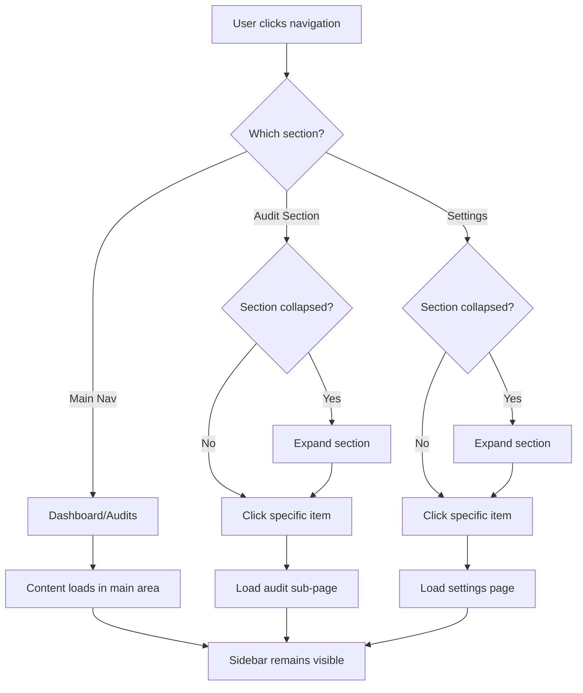

# Sidebar Unification Plan

## Problem Analysis

Based on the screenshot and code analysis, I've identified the following issues:

### Current Issues

1. **Duplicate Menu Items**
   - "Team" appears both in main sidebar AND in Settings submenu
   - "Billing" appears in both places as well

2. **Multiple Sidebars**
   - Main sidebar in [`Sidebar.tsx`](frontend/components/layout/Sidebar.tsx)
   - Secondary Settings sidebar in [`settings/layout.tsx`](frontend/app/(app)/settings/layout.tsx:54)
   - Separate Audit sidebar in [`AuditSidebar.tsx`](frontend/components/audit/AuditSidebar.tsx)

3. **Inconsistent UX**
   - Settings pages show TWO navigation areas (main sidebar + settings nav)
   - Audit pages completely replace the main sidebar
   - Navigation context is lost when moving between sections

### Current Structure

```
Main App Layout (app)
├── Sidebar.tsx (always visible)
│   ├── Dashboard
│   ├── Audits
│   ├── Team → /settings/team
│   ├── Billing → /settings/billing
│   └── Settings → /settings/profile
│
└── Settings Layout (nested)
    └── Settings Nav (second sidebar!)
        ├── Profile
        ├── Team (DUPLICATE!)
        ├── Billing (DUPLICATE!)
        ├── Appearance
        └── Notifications

Audit Layout (audit) - COMPLETELY SEPARATE
└── AuditSidebar.tsx (replaces everything)
    ├── Summary
    ├── SEO
    ├── Performance
    ├── AI Analysis
    └── ... many more items
```

---

## Proposed Solution: Unified Collapsible Sidebar

### Design Principles

1. **Single sidebar** for the entire application
2. **Collapsible sections** for grouped navigation
3. **Context-aware** - shows relevant items based on current page
4. **No duplicates** - each item appears once in a logical location
5. **Consistent UX** - same navigation pattern everywhere

### New Structure

```
Unified Sidebar
├── Logo + Workspace Switcher
│
├── [MAIN NAVIGATION]
│   ├── Dashboard
│   └── Audits
│
├── [CURRENT AUDIT] ← Only when viewing an audit
│   ├── ▼ Overview (collapsible)
│   │   ├── Summary
│   │   ├── SEO
│   │   ├── Performance
│   │   └── AI Analysis
│   ├── ▼ Reports (collapsible)
│   │   ├── PDF Report
│   │   ├── Client Report
│   │   └── Comparison
│   ├── ▼ Tools (collapsible)
│   │   └── ... tools items
│   └── ▼ System (collapsible)
│       ├── Debug
│       ├── Status
│       └── Tasks
│
├── [SETTINGS] ← Always visible, collapsible
│   ├── ▼ Settings (click to expand)
│   │   ├── Profile
│   │   ├── Team
│   │   ├── Billing
│   │   ├── Appearance
│   │   └── Notifications
│
└── [USER SECTION]
    ├── Workspace Info
    └── Sign Out
```

### Visual Mockup

```
┌─────────────────────────────────┐
│ ✨ SiteSpector                  │
├─────────────────────────────────┤
│ [Workspace Switcher     ▼]      │
├─────────────────────────────────┤
│ 📊 Dashboard                    │
│ 📋 Audits                       │
├─────────────────────────────────┤
│ CURRENT AUDIT (when active)     │
│ ▼ Overview                      │
│   └ Summary                     │
│   └ SEO                         │
│   └ Performance                 │
│   └ AI Analysis                 │
│ ▶ Reports (collapsed)           │
│ ▶ Tools (collapsed)             │
│ ▶ System (collapsed)            │
├─────────────────────────────────┤
│ ▼ Settings                      │
│   └ Profile                     │
│   └ Team                        │
│   └ Billing                     │
│   └ Appearance                  │
│   └ Notifications               │
├─────────────────────────────────┤
│ Workspace Name                  │
│ Role: Owner                     │
│ [Sign out]                      │
└─────────────────────────────────┘
```

---

## Implementation Plan

### Phase 1: Create New Unified Sidebar Component

**File:** `frontend/components/layout/UnifiedSidebar.tsx`

```typescript
// Structure
- SidebarHeader (logo)
- WorkspaceSwitcher
- MainNavigation (Dashboard, Audits)
- AuditNavigation (conditional, collapsible sections)
- SettingsNavigation (collapsible)
- UserSection
```

Key features:
- Use Radix UI Accordion for collapsible sections
- Track current audit ID from URL params
- Auto-expand relevant section based on current path
- Persist expanded state in localStorage

### Phase 2: Update Route Layouts

#### 2.1 Modify `app/(app)/layout.tsx`

- Keep using the sidebar
- Pass current audit context if viewing an audit

#### 2.2 Remove Settings Secondary Sidebar

**File:** `frontend/app/(app)/settings/layout.tsx`

- Remove the sidebar navigation from settings layout
- Keep only the content wrapper
- Settings navigation now lives in main UnifiedSidebar

**Before:**
```tsx
<div className="flex">
  <nav>Settings sidebar</nav>  // REMOVE
  <div>{children}</div>
</div>
```

**After:**
```tsx
<div className="container">
  {children}
</div>
```

#### 2.3 Move Audit Pages Under Main Layout

**Current structure:**
```
app/
├── (app)/      ← has main sidebar
│   └── dashboard/
└── (audit)/    ← separate, no main sidebar
    └── audits/[id]/
```

**New structure:**
```
app/
└── (app)/      ← unified sidebar
    ├── dashboard/
    ├── settings/
    └── audits/[id]/  ← MOVED HERE
```

This ensures:
- Main sidebar is always visible
- Audit section appears in sidebar when viewing audit
- No separate AuditSidebar needed

### Phase 3: Create Collapsible Navigation Components

#### 3.1 `NavSection.tsx` - Collapsible Section Component

```tsx
interface NavSectionProps {
  title: string
  icon: LucideIcon
  items: NavItem[]
  defaultOpen?: boolean
}
```

#### 3.2 `NavItem.tsx` - Individual Navigation Item

```tsx
interface NavItemProps {
  href: string
  icon: LucideIcon
  label: string
  disabled?: boolean
  badge?: string
}
```

### Phase 4: Update Mobile Navigation

**File:** `frontend/components/layout/MobileSidebar.tsx`

- Match desktop UnifiedSidebar structure
- Use Sheet component for slide-out menu
- Include all collapsible sections

### Phase 5: Clean Up Old Components

Files to **modify or remove**:
- `frontend/components/audit/AuditSidebar.tsx` - DELETE
- `frontend/components/audit/AuditMobileSidebar.tsx` - DELETE
- `frontend/app/(audit)/layout.tsx` - DELETE
- `frontend/app/(audit)/audits/[id]/layout.tsx` - SIMPLIFY

---

## Navigation Items Structure

### Main Navigation
| Item | Icon | Path | Always Visible |
|------|------|------|----------------|
| Dashboard | LayoutDashboard | /dashboard | ✅ |
| Audits | FileSearch | /dashboard | ✅ |

### Audit Navigation (Contextual)
Only shown when `auditId` is present in URL.

| Section | Items |
|---------|-------|
| **Overview** | Summary, SEO, Performance, AI Analysis |
| **Reports** | Comparison, PDF Report, Client Report, Benchmark |
| **Advanced** | Architecture, Competitors, Debug |
| **Tools** | Quick Wins, Tech Stack, Security, UX Check |

### Settings Navigation (Collapsible)
| Item | Icon | Path |
|------|------|------|
| Profile | User | /settings/profile |
| Team | Users | /settings/team |
| Billing | CreditCard | /settings/billing |
| Appearance | Palette | /settings/appearance |
| Notifications | Bell | /settings/notifications |

---

## State Management

### URL-based Audit Context

```tsx
// In UnifiedSidebar
const pathname = usePathname()

// Extract audit ID from path
const auditMatch = pathname.match(/\/audits\/([^\/]+)/)
const currentAuditId = auditMatch ? auditMatch[1] : null

// Show audit navigation only when viewing an audit
{currentAuditId && <AuditNavSection auditId={currentAuditId} />}
```

### Expanded Sections State

```tsx
// Default expanded based on current path
const getDefaultExpanded = () => {
  if (pathname.startsWith('/settings')) return ['settings']
  if (pathname.includes('/audits/')) return ['audit-overview']
  return []
}

// Use Accordion with multiple open sections
<Accordion type="multiple" defaultValue={getDefaultExpanded()}>
```

---

## Mermaid Diagram: New Navigation Flow



---

## Files to Create/Modify

### New Files
- `frontend/components/layout/UnifiedSidebar.tsx` - Main unified sidebar
- `frontend/components/layout/NavSection.tsx` - Collapsible section component
- `frontend/components/layout/NavItem.tsx` - Navigation item component

### Files to Modify
- `frontend/app/(app)/layout.tsx` - Use UnifiedSidebar
- `frontend/app/(app)/settings/layout.tsx` - Remove sidebar, keep content wrapper only
- `frontend/components/layout/MobileSidebar.tsx` - Update to match new structure

### Files to Delete
- `frontend/components/audit/AuditSidebar.tsx`
- `frontend/components/audit/AuditMobileSidebar.tsx`
- `frontend/components/audit/AuditMenuItem.tsx`
- `frontend/app/(audit)/layout.tsx`
- `frontend/app/(audit)/audits/[id]/layout.tsx`

### Files to Move
- All pages from `frontend/app/(audit)/audits/` → `frontend/app/(app)/audits/`

---

## Migration Checklist

- [ ] Create `NavSection` component with accordion
- [ ] Create `NavItem` component (consolidate from existing)
- [ ] Create `UnifiedSidebar` component
- [ ] Update main app layout to use `UnifiedSidebar`
- [ ] Simplify settings layout (remove sidebar)
- [ ] Move audit pages to (app) route group
- [ ] Delete old audit-specific components
- [ ] Update `MobileSidebar` component
- [ ] Test all navigation paths
- [ ] Verify mobile responsiveness
- [ ] Update Context7 documentation

---

## Questions for User

1. **Should collapsed sections remember their state?** (e.g., if I expand Settings, should it stay expanded after navigating away and back?)

2. **Audit navigation - always show all sections or auto-collapse based on context?**

3. **Do you want a "Back to Dashboard" link visible when viewing an audit?**
